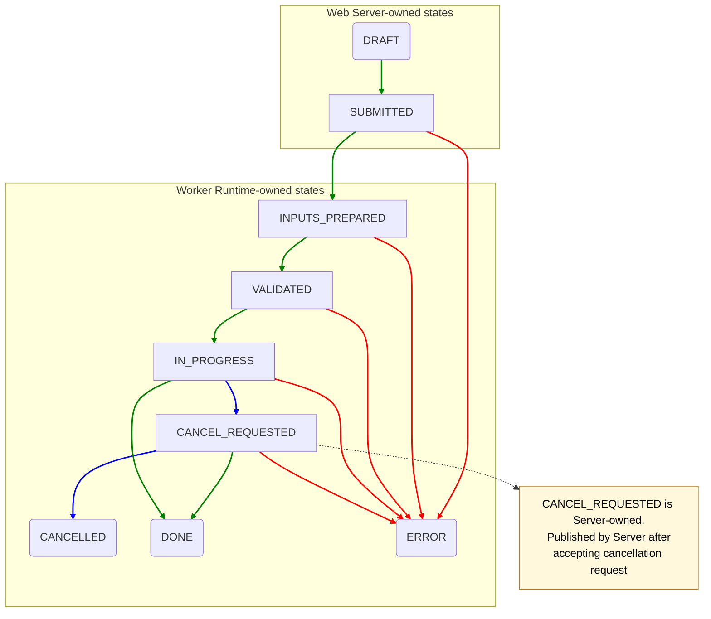
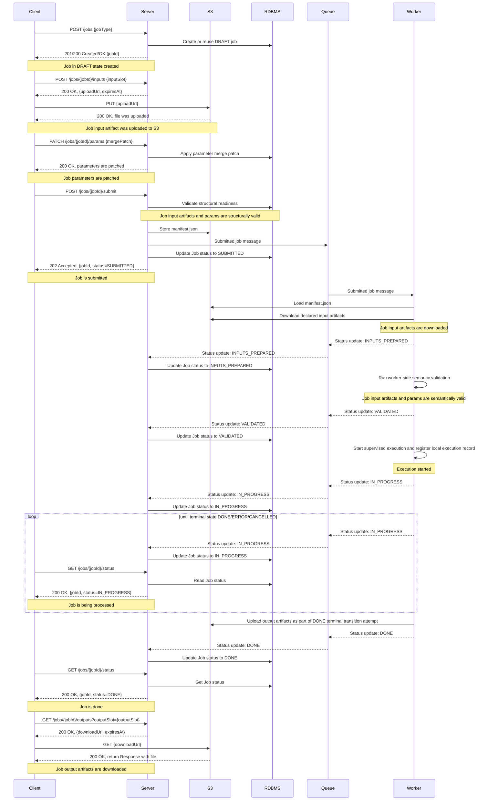
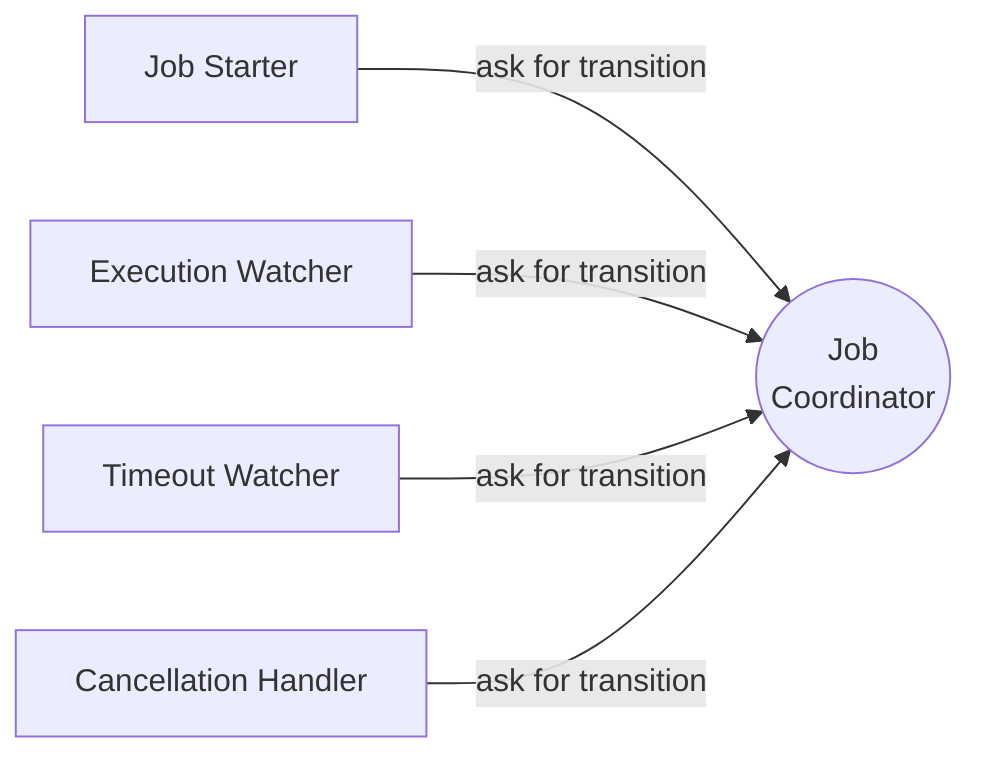
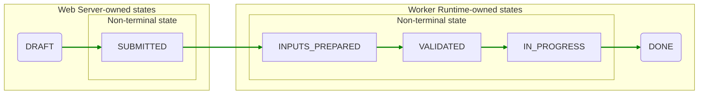
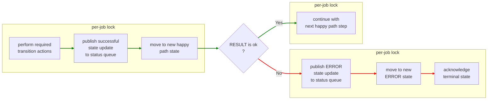

<!-- 
Copyright (c) 2025 Oleksiy Oleksandrovych Sayankin. All Rights Reserved.
Refer to the LICENSE file in the root directory for full license details.
-->

# MDDS Job Orchestrator Architecture

<!-- TOC -->
* [MDDS Job Orchestrator Architecture](#mdds-job-orchestrator-architecture)
  * [Overview](#overview)
  * [Architectural Goal](#architectural-goal)
  * [Main Responsibilities](#main-responsibilities)
    * [Web Server (Orchestrator)](#web-server-orchestrator)
    * [Worker](#worker)
    * [Object Storage (S3 / MinIO)](#object-storage-s3--minio)
    * [Metadata Store (RDBMS)](#metadata-store-rdbms)
  * [Job Lifecycle](#job-lifecycle)
    * [Supported statuses](#supported-statuses)
    * [Lifecycle rules](#lifecycle-rules)
  * [Client-Server Interaction](#client-server-interaction)
  * [Object Storage Layout](#object-storage-layout)
  * [Worker API and configuration](#worker-api-and-configuration)
    * [Worker runtime lifecycle](#worker-runtime-lifecycle)
    * [Worker internal services](#worker-internal-services)
    * [Failure policy](#failure-policy)
    * [Timeout policy](#timeout-policy)
    * [Worker environment variables](#worker-environment-variables)
    * [Job cancellation](#job-cancellation)
    * [Job handler contract](#job-handler-contract)
      * [Job handler validation method contract](#job-handler-validation-method-contract)
      * [Job handler data access pattern](#job-handler-data-access-pattern)
    * [Local execution registry](#local-execution-registry)
    * [Worker job state transition coordination](#worker-job-state-transition-coordination)
    * [Terminal status publication rule](#terminal-status-publication-rule)
    * [Submitted job message](#submitted-job-message)
    * [Status update message](#status-update-message)
    * [Cancellation message](#cancellation-message)
  * [REST API v1](#rest-api-v1)
    * [1. Create or Reuse a Draft Job](#1-create-or-reuse-a-draft-job)
    * [2. Request a Pre-Signed Upload URL for an Input Artifact](#2-request-a-pre-signed-upload-url-for-an-input-artifact)
    * [3. Patch Job Parameters](#3-patch-job-parameters)
    * [4. Submit a Job for Execution](#4-submit-a-job-for-execution)
    * [5. Get Job State](#5-get-job-state)
    * [6. Request Job Cancellation](#6-request-job-cancellation)
    * [7. Request a Pre-Signed Download URL for an Output Artifact](#7-request-a-pre-signed-download-url-for-an-output-artifact)
  * [Manifest v1](#manifest-v1)
    * [Example manifest for SLAE solving](#example-manifest-for-slae-solving)
    * [Field meaning](#field-meaning)
  * [SLAE Job Profile (v1)](#slae-job-profile-v1)
    * [Required input slots](#required-input-slots)
    * [Required execution parameter](#required-execution-parameter)
    * [Expected output](#expected-output)
  * [Extension Model](#extension-model)
  * [Summary](#summary)
<!-- TOC -->

## Overview

This document describes the target architecture of the Modeling of the Dynamic of Distributed Systems (MDDS)
job orchestration platform.

The system is designed as a **generic job orchestrator**. Its main responsibility is **not** to understand the internal business logic of every task. Instead, it manages the full lifecycle of a job:

- creating a job;
- accepting input artifacts for that job;
- scheduling the job for execution;
- tracking job status;
- requesting cancellation;
- providing access to results.

The actual meaning of a job is defined by two things:

1. the job type (`jobType`);
2. the job manifest (`manifest.json`).

This design allows the platform to support multiple job types in the future. At the current stage, the primary
supported job type is solving Systems of Linear Algebraic Equations (SLAE).

---

## Architectural Goal

The long-term goal is to build a system where:

- the **Web Server** acts as a **job orchestrator**;
- **Workers** execute concrete job types;
- **Object Storage** (S3/MinIO) stores job inputs, outputs, and manifests;
- the **Metadata Store** (RDBMS) stores job lifecycle data such as status, timestamps, owner, and progress.

In other words, the platform coordinates work, but the business meaning of the work is delegated to Workers through manifests.

---

## Main Responsibilities

### Web Server (Orchestrator)

The Web Server is responsible for:

- creating jobs and assigning job identifiers;
- issuing pre-signed upload URLs for input artifacts;
- validating whether a job is ready for submission. This is structural validation and means whether all required input
  slots and required parameters are present and parameter values conform to their declared types. Detailed semantic verification is performed
  by Worker;
- generating the job manifest;
- publishing jobs to the execution queue;
- exposing job status to clients;
- accepting cancellation requests;
- consuming asynchronous lifecycle updates from Workers;
- persisting updates from Workers to Metadata Store;
- issuing pre-signed download URLs for results;
- persisting the latest known `workerId` for the job in Metadata Store;
- optionally reconciling stale jobs that remain in non-terminal states for too long.

The Web Server should not contain job-specific execution logic.

Note, Web Server does **not** synchronously query Workers in ordinary `GET` processing, it returns persisted job state
from Metadata Store.

### Worker

The Worker is responsible for:

- consuming submitted jobs from the queue;
- reading `manifest.json` from object storage;
- selecting the correct handler for the given `jobType`;
- downloading input artifacts;
- performing job-specific semantic validation before execution;
- publishing lifecycle updates through Worker Runtime; pre-execution statuses
  (`INPUTS_PREPARED`, `VALIDATED`), terminal statuses, and the initial
  `IN_PROGRESS` publication are coordinated by the Worker Runtime job state
  transition coordinator;
- executing the actual job logic;
- uploading output artifacts;
- publishing lifecycle status updates including its `workerId` when it claims a
  submitted job for local processing and later supervised execution.

### Object Storage (S3 / MinIO)

Object storage is responsible for:

- storing all input artifacts;
- storing output artifacts;
- storing `manifest.json`;
- optionally storing logs and auxiliary execution artifacts.

### Metadata Store (RDBMS)

The relational database is responsible for:

- storing job metadata;
- storing job lifecycle status;
- storing timestamps;
- storing user/job relationships;
- storing job parameter data and relationships to jobs;
- supporting filtering, querying, and future administrative pages;
- storing `workerId` as nullable current job owner identifier.

---

## Job Lifecycle

Each job moves through a defined set of statuses.

### Supported statuses

The diagram below shows the public job lifecycle transitions.



* `DRAFT` — the job has been created, but input artifacts and parameters are still being provided by the client;
* `SUBMITTED` — the job has been accepted into the execution pipeline, its input artifacts and parameters are immutable, and the submitted job message has been published to the execution queue;
* `INPUTS_PREPARED` — a Worker has started local processing of the submitted job, loaded the manifest, created the local job workspace, downloaded declared input artifacts, and created the runtime execution context;
* `VALIDATED` — worker-side semantic validation has completed successfully, but supervised execution has not started yet;
* `IN_PROGRESS` — a Worker has started supervised execution for the job;
* `CANCEL_REQUESTED` — a cancellation request has been accepted for a running job and forwarded to the Worker that owns the job;
* `CANCELLED` — the Worker confirmed that execution was cancelled; this is a terminal state;
* `DONE` — the job completed successfully and expected output artifacts were published; this is a terminal state;
* `ERROR` — the job failed because of a runtime, infrastructure, preparation, validation-processing, timeout, output-upload, or execution error; this is a terminal state.

### Lifecycle rules

- A newly created job always starts in `DRAFT`.
- A job can be submitted only after all required inputs and required parameters have been provided.
- After a job is submitted, its input artifacts and parameters must be treated as immutable.
- `POST /jobs/{jobId}/cancel` does not mean the job is already cancelled.
  It means cancellation has been requested. `CANCEL_REQUESTED` is a non-terminal
  state. If cancellation wins on the execution side, the final state becomes
  `CANCELLED`. If execution completion or runtime failure is committed first by
  the Worker Runtime job state transition coordinator, the final state may become
  `DONE` or `ERROR` instead.
- `CANCEL_REQUESTED` may transition to `CANCELLED`, `DONE`, or `ERROR`.
  Cancellation is best-effort and does not reserve `CANCELLED` as the only
  possible final state.
- Cancellation is supported only for jobs that are already in `IN_PROGRESS` state and have a known `workerId`.
- Jobs in `DRAFT` are not cancellable; the client may simply stop using the draft job.
- Jobs in `SUBMITTED`, `INPUTS_PREPARED`, or `VALIDATED` are already accepted into the execution pipeline, but supervised execution has not started yet. Cancellation before supervised execution is out of scope for v1.
- Downloading results is allowed only when the job is in `DONE`.
- An upload session id is valid only for the draft phase of a job. Once the job leaves `DRAFT`, that session id is closed and must not be reused.
- `SUBMITTED` means the job has been accepted into the execution pipeline and became immutable.
- Semantic validation is performed by the Worker after input preparation. If
  validation succeeds, the job transitions from `INPUTS_PREPARED` to `VALIDATED`.
  If validation raises `ValidationFailed` or non-`ValidationFailed` exception, the job transitions from
  `INPUTS_PREPARED` to terminal `ERROR`.
- The `SUBMITTED` -> `ERROR` transition applies to Worker-side preparation failures
  after the Worker Runtime has determined `jobId`, `userId`, and `jobType`.
  Failures before job identity is known are handled by the configured retry,
  dead-letter, or reconciliation policy and may not produce a Worker status update.
---

## Client-Server Interaction

The diagram below shows the main sequence of interactions from creating job and obtaining its results.
The diagram shows the successful happy-path scenario. Validation failure, runtime error and cancellation flows are described separately.



---

## Object Storage Layout

Each job uses a dedicated object prefix.

File structure for a job:

```text
jobs/{userId}/{jobId}/manifest.json
jobs/{userId}/{jobId}/in/{inputFileName}
jobs/{userId}/{jobId}/out/{outputFileName}
jobs/{userId}/{jobId}/logs/{logFile}
```

Examples:

```text
jobs/42/abc-123/manifest.json
jobs/42/abc-123/in/matrix.csv
jobs/42/abc-123/in/rhs.csv
jobs/42/abc-123/out/solution.csv
```

Note: in S3-compatible storage these are object keys with prefixes, not real directories.

---

## Worker API and configuration

MDDS Python Worker Runtime is a reusable worker template.
It handles RabbitMQ, S3, manifest loading, status publishing,
cancellation, progress reporting, output upload, ack/nack, and lifecycle errors.
A concrete worker implementation provides only job-specific validation and execution logic.
Extension point:

```python
class JobHandler:
    def validate(self, context: JobExecutionContext) -> None:
        ...

    def execute(self, context: JobExecutionContext) -> None:
        ...
```

`workerId` is included in all Worker-published status updates for observability
and ownership tracing.

For `INPUTS_PREPARED` and `VALIDATED`, `workerId` identifies the Worker that is
preparing or validating the job, but targeted cancellation is still not supported
until the job reaches `IN_PROGRESS`.

Only `IN_PROGRESS` workerId is used by the Web Server for targeted cancellation
in v1.

For terminal statuses such as `ERROR`, `DONE`, and
`CANCELLED`, `workerId` is used for observability and auditability.

### Worker runtime lifecycle

On startup the runtime:

1. resolves `workerId`;
2. creates RabbitMQ and S3 clients;
3. resolves the cancellation queue name;
4. subscribes to the resolved cancellation queue;
5. resolves the job queue name;
6. subscribes to the resolved job queue.

By default, the job queue name is `queue-${MDDS_WORKER_JOB_TYPE}`.
By default, the cancellation queue name is `cancel.queue-${MDDS_WORKER_ID}`.
For each job message the runtime:

1. extracts `manifestObjectKey`;
2. loads `manifest.json` from object storage;
3. validates manifest schema;
4. once `jobId`, `userId`, and `jobType` are known, creates the
   per-job worker-local state in the job state transition coordinator;
5. downloads declared input artifacts and creates `JobExecutionContext` as a
   coordinator-owned transition from `SUBMITTED` to `INPUTS_PREPARED`;
6. during this transition, the Worker Runtime publishes `INPUTS_PREPARED`
   with `workerId` after the local runtime context has been prepared and commits
   the `INPUTS_PREPARED` state;
7. calls `handler.validate(context)` as a coordinator-owned validation
   transition from `INPUTS_PREPARED` to `VALIDATED`;
8. during this transition, if validation succeeds, the Worker Runtime publishes
   `VALIDATED` with `workerId` and commits the `VALIDATED` state;
9. if `handler.validate(context)` raises `ValidationFailed`, requests the
   coordinator to commit terminal `ERROR`;
10. if `handler.validate(context)` raises any other exception and job identity is
    known, requests the coordinator to commit terminal `ERROR`;
11. requests the coordinator to start supervised execution as a transition from
    `VALIDATED` to `IN_PROGRESS`;
12. during this transition, the Worker Runtime starts the supervised process,
    registers the local execution record in the execution registry, and only then
    publishes `IN_PROGRESS` with `workerId`;
13. after successful `IN_PROGRESS` publication, the coordinator commits the
    public worker lifecycle state as `IN_PROGRESS`;
14. when the supervised process completes successfully, the Worker Runtime requests the
    coordinator to commit terminal `DONE` with progress `100`;
15. the `DONE` terminal transition attempt includes collecting output artifacts
    produced through runtime-provided output abstractions, uploading them to
    object storage, publishing terminal `DONE`, committing the terminal
    transition, and acknowledging the original submitted job message;
16. acknowledges the job message only through the job state transition
    coordinator after a terminal transition has been successfully committed.

> The Worker Runtime publishes the initial `IN_PROGRESS` status only after the
> local execution record has been registered. This ensures that once
> `IN_PROGRESS` is externally visible, targeted cancellation for that job can be
> applied by the cancellation listener.

The runtime also starts a cancellation listener. The listener subscribes to
`MDDS_WORKER_CANCEL_QUEUE_NAME`.

When a cancellation message is received, the cancellation listener accepts the
local cancellation request and asks the execution supervisor to terminate the
supervised job process. After the supervisor confirms that the process has been
terminated, the Worker Runtime requests the job state transition coordinator to
commit terminal `CANCELLED`.

The original submitted job message is acknowledged only through the job state transition coordinator
after successful `CANCELLED` status publication and
successful terminal transition commit.

The runtime acknowledges the job message only after the job reaches a terminal state
from the worker point of view: `DONE`, `ERROR`, `CANCELLED`.

For each job, the Worker Runtime must publish at most one terminal status:
`DONE`, `ERROR`, `CANCELLED`.

The first successfully committed terminal transition wins.
After a terminal status has been successfully published and committed, all later
terminal attempts for the same `jobId` must be ignored and logged.

If the runtime fails before publishing a terminal status, it may reject/nack the job message according to the configured retry policy.

Retry and dead-letter policy are implementation-specific in v1.

While the supervised job process is running, the Worker Runtime periodically publishes `IN_PROGRESS`
status updates according to `MDDS_WORKER_PROGRESS_INTERVAL_SECONDS`.
The progress value is calculated from elapsed execution time relative to `MDDS_WORKER_JOB_TIMEOUT_SECONDS`.

### Worker internal services

The Worker Runtime consists of the following internal services:

- **Job consumer** — consumes submitted job messages from the job queue.
- **Execution supervisor** — starts and tracks supervised job processes.
- **Execution registry** — stores active job execution records by `jobId`.
- **Cancellation listener** — consumes cancellation messages from the worker-specific cancellation queue.
- **Execution watcher** — observes child process completion and requests the
  job state transition coordinator to commit `DONE` or `ERROR`.
- **Cleanup watcher** — requests the job state transition coordinator to perform
  cleanup for jobs marked as cleanup-eligible. Physical resource cleanup and
  local execution record removal are performed only as a coordinator-owned
  cleanup transition.
- **Timeout watcher** — terminates jobs that exceed configured runtime timeout and requests the job state transition coordinator to commit `ERROR`.

These services are internal runtime implementation details. A concrete job handler must not interact with them directly.

The supervised job process communicates its result to the main Worker Runtime through an internal IPC channel.
The concrete IPC mechanism is implementation-specific.
In v1 it may be a multiprocessing Pipe.

The child process must not publish lifecycle statuses directly.
It returns execution outcome to the main runtime, and the main runtime requests
terminal status publication through the job state transition coordinator.

### Failure policy

If input artifact preparation fails after the runtime has already determined
`jobId`, `userId`, and `jobType`, the job transitions from `SUBMITTED` to
terminal `ERROR`. The job must not publish or commit `INPUTS_PREPARED`.

The submitted job message is acknowledged only through the coordinator after
successful `ERROR` status publication and successful terminal transition commit.

If `handler.validate(context)` raises `ValidationFailed` or any other exception, 
the job transitions from `INPUTS_PREPARED` to terminal `ERROR`.

If supervised execution cannot be started after validation succeeded, the job
transitions from `VALIDATED` to terminal `ERROR`.

If supervised execution fails after `IN_PROGRESS` was published, the job
transitions from `IN_PROGRESS` to terminal `ERROR`.

If manifest loading, manifest schema validation, submitted job message parsing,
or input preparation fails before the runtime can determine `jobId`, `userId`,
or `jobType`, the runtime logs the error and rejects or nacks the message
according to the configured retry policy.

If output artifact collection or upload fails during the `DONE` terminal
transition attempt, the coordinator must roll back the `DONE` claim. The runtime
must not publish `DONE`.

After the failed `DONE` terminal transition attempt, the runtime failure path must request the
coordinator to commit terminal `ERROR`.

A cancellation request that arrived during the `DONE` attempt is stale because
supervised execution has already completed.

The exact retry and dead-letter policy is implementation-specific in v1.

In v1, semantic validation is performed in the main worker process before
supervised execution starts. If validation is expected to be long-running for
some future job type, it should be moved into supervised execution in a later
version.

Cancellation is supported only after the job enters `IN_PROGRESS`; therefore
validation itself is not cancellable in v1.

### Timeout policy

The Worker Runtime may enforce a maximum execution time for a running job.

If a job remains in `IN_PROGRESS` longer than
`MDDS_WORKER_JOB_TIMEOUT_SECONDS`, the timeout watcher terminates the supervised
job process and requests the job state transition coordinator to commit `ERROR`
with a timeout message.

If a job is already in `CANCEL_REQUESTED` but cancellation finalization cannot
complete successfully, the Worker Runtime may also commit terminal `ERROR`.
This corresponds to the public `CANCEL_REQUESTED` -> `ERROR` transition.

The original submitted job message is acknowledged only through the job state transition
coordinator after successful `ERROR` status publication and
successful terminal transition commit.

Timeout is treated as runtime failure, not as cancellation.

### Worker environment variables

The table below lists environment variables used to configure the Worker runtime.

| Variable Name                                   | Required | Default Value                    | Meaning                                                                     | Example                                   |
|-------------------------------------------------|---------:|----------------------------------|-----------------------------------------------------------------------------|-------------------------------------------|
| `MDDS_WORKER_ID`                                |       No | `worker-{hostname}-{uuid}`       | Stable worker identifier used for status updates and targeted cancellation. | `worker-slae-1`                           |
| `MDDS_WORKER_JOB_TYPE`                          |      Yes | —                                | Job type this worker can execute. Used to derive the job queue name.        | `solving_slae`                            |
| `MDDS_WORKER_JOB_QUEUE_NAME`                    |       No | `queue-${MDDS_WORKER_JOB_TYPE}`  | RabbitMQ queue from which submitted jobs are consumed.                      | `queue-solving_slae`                      |
| `MDDS_WORKER_CANCEL_QUEUE_NAME`                 |       No | `cancel.queue-${MDDS_WORKER_ID}` | RabbitMQ queue used for targeted cancellation messages.                     | `cancel.queue-worker-slae-1`              |
| `MDDS_WORKER_STATUS_QUEUE_NAME`                 |       No | `mdds_status_queue`              | RabbitMQ queue where worker publishes job status updates.                   | `mdds_status_queue`                       |
| `MDDS_RABBITMQ_HOST`                            |      Yes | —                                | RabbitMQ host.                                                              | `rabbitmq`                                |
| `MDDS_RABBITMQ_PORT`                            |       No | `5672`                           | RabbitMQ AMQP port.                                                         | `5672`                                    |
| `MDDS_RABBITMQ_USER`                            |      Yes | —                                | RabbitMQ username.                                                          | `mdds`                                    |
| `MDDS_RABBITMQ_PASSWORD`                        |      Yes | —                                | RabbitMQ password.                                                          | `secret`                                  |
| `MDDS_OBJECT_STORAGE_BUCKET`                    |      Yes | —                                | S3/MinIO bucket with manifests, inputs and outputs.                         | `mdds`                                    |
| `MDDS_OBJECT_STORAGE_INTERNAL_ENDPOINT`         |      Yes | —                                | Internal S3/MinIO endpoint used by Worker.                                  | `http://minio:9000`                       |
| `MDDS_OBJECT_STORAGE_REGION`                    |       No | `us-east-1`                      | S3 region.                                                                  | `us-east-1`                               |
| `MDDS_OBJECT_STORAGE_ACCESS_KEY`                |      Yes | —                                | S3 access key.                                                              | `minioadmin`                              |
| `MDDS_OBJECT_STORAGE_SECRET_KEY`                |      Yes | —                                | S3 secret key.                                                              | `minioadmin`                              |
| `MDDS_OBJECT_STORAGE_PATH_STYLE_ACCESS_ENABLED` |       No | `true`                           | Whether to use path-style S3 addressing. Usually required for MinIO.        | `true`                                    |
| `MDDS_WORKER_HANDLER`                           |      Yes | —                                | Python import path of concrete job handler.                                 | `mdds_slae_worker.handler:SlaeJobHandler` |
| `MDDS_WORKER_JOB_TIMEOUT_SECONDS`               |       No | `3600`                           | Maximum execution time for one job.                                         | `3600`                                    |
| `MDDS_WORKER_CLEANUP_INTERVAL_SECONDS`          |       No | `1`                              | Cleanup watcher polling interval.                                           | `1`                                       |
| `MDDS_WORKER_PROGRESS_INTERVAL_SECONDS`         |       No | `5`                              | Interval for publishing time-based `IN_PROGRESS` updates.                   | `5`                                       |
| `MDDS_WORKER_LOCAL_ROOT`                        |       No | `/opt/mdds`                      | Local root folder for Worker Runtime job workspaces.                        | `/opt/mdds`                               |

If `MDDS_WORKER_JOB_QUEUE_NAME` is not set, the runtime derives it as:

```text
queue-${MDDS_WORKER_JOB_TYPE}
```

This must match the queue name used by the Web Server when submitting a job.

`MDDS_WORKER_JOB_TIMEOUT_SECONDS`, `MDDS_WORKER_PROGRESS_INTERVAL_SECONDS` and `MDDS_WORKER_CLEANUP_INTERVAL_SECONDS` must be greater than zero.

### Job cancellation

Although `workerId` is known for `INPUTS_PREPARED` and `VALIDATED`, targeted
cancellation is intentionally enabled only after `IN_PROGRESS` in v1. This keeps
pre-execution preparation and validation non-cancellable and avoids cancellation
semantics before the supervised process exists.

After the Worker Runtime consumes a submitted job message, it keeps that message
unacknowledged until the job reaches a committed terminal state:
`DONE`, `ERROR`, `CANCELLED`.
When cancellation succeeds, the Worker Runtime requests the job state transition coordinator
to commit `CANCELLED`. The original submitted job message is acknowledged only through the job state transition coordinator
after successful `CANCELLED` status publication and successful terminal transition commit.

If the supervised process has already completed successfully and the Worker
Runtime has started the `DONE` terminal transition attempt, cancellation must not
interrupt that `DONE` attempt.

The cancellation request waits until the active `DONE` attempt is committed or
rolled back.

If the `DONE` attempt commits successfully, the cancellation request is stale.

If the `DONE` attempt rolls back because output artifact collection or upload
failed, the runtime failure path attempts to commit `ERROR`; the cancellation
request remains stale because supervised execution has already completed.

If `MDDS_WORKER_CANCEL_QUEUE_NAME` is not set, the runtime derives it as:

```text
cancel.queue-${MDDS_WORKER_ID}
```

If the Worker has already committed terminal `CANCELLED`, it must not publish `DONE`.
Partially produced output artifacts are implementation-defined and must not be exposed through
the public output download endpoint because downloads are allowed only in `DONE` state.

Cancellation is best-effort.
If the job has already reached a committed terminal state before the
cancellation listener terminates it, the cancellation request is ignored and no
additional terminal status is published.

### Job handler contract

A concrete worker implementation must provide a handler class.

The handler is responsible for:

- validating job-specific input artifacts and parameters;
- executing the job-specific business logic;
- producing output artifacts expected by the manifest through runtime-provided output abstractions.

The handler must produce output artifacts only through `context.outputs` or another runtime-provided output writer.

The handler is not responsible for cancellation in v1. Cancellation is handled by the Worker Runtime.

The handler must not:

- consume RabbitMQ messages directly;
- consume cancellation messages directly;
- publish lifecycle statuses directly;
- acknowledge or reject job messages;
- construct S3 object keys manually;
- update the Metadata Store directly;
- upload output artifacts directly to S3.

Also note that in `JobHandler`

```python
class JobHandler:
    def validate(self, context: JobExecutionContext) -> None:
        ...

    def execute(self, context: JobExecutionContext) -> None:
        ...
```

`validate(context)` and `execute(context)` must not rely on shared in-memory state.
The Worker Runtime may call `validate(context)` in the main worker process and `execute(context)` in a fresh supervised process.
Therefore `execute(context)` must be able to run using only `JobExecutionContext` and files available through that context.
Any data required by `execute(context)` must be read from `JobExecutionContext` inputs, parameters, or other runtime-provided artifacts, not from state produced during `validate(context)`.


#### Job handler validation method contract

A concrete `JobHandler` must implement semantic validation in:

```python
def validate(self, context: JobExecutionContext) -> None:
    ...
```

The purpose of `validate(context)` is to check whether submitted job inputs and parameters are semantically valid for the concrete job type.

The method must use only `JobExecutionContext` to access inputs and parameters. It must not publish lifecycle statuses, acknowledge queue messages, access RabbitMQ, access object storage directly, or update external metadata.

If validation succeeds, `validate(context)` must return normally.

If submitted job inputs or parameters are semantically invalid, the handler must raise `ValidationFailed`.

`validate(context)` must not produce output artifacts and must not store data in `self` for later use by `execute(context)`. The Worker Runtime may call `validate(context)` in the main worker process and `execute(context)` in a fresh supervised process.


Example:

```python
#
# Pseudo-code example; imports are omitted for brevity.
#
class ExampleJobHandler:
    def validate(self, context: JobExecutionContext) -> None:
        # Replace "input_slot" with a real logical input slot declared
        # in manifest.inputs.
        raw_value = context.inputs.read("input_slot")

        try:
            # Perform job-specific semantic checks for raw_value here.
            ...
        except ValueError as error:
            raise ValidationFailed(
                "Invalid data for input 'input_slot'."
            ) from error
```

Only `ValidationFailed` represents expected domain validation failure.

When `validate(context)` raises `ValidationFailed`, the Worker Runtime treats the job as terminally validation-failed:

* requests the job state transition coordinator to commit `ERROR`;
* includes the validation failure message in the status update;
* does not publish `VALIDATED`;
* does not publish `IN_PROGRESS`;
* does not start supervised execution;
* does not add the job to the local execution registry;
* acknowledges the submitted job message only through the job state transition
  coordinator after successful `ERROR` status publication and
  successful terminal transition commit;
* cleans up the local prepared job workspace only after the terminal transition
  has been successfully committed, or after rollback only when the runtime has
  decided to abandon, reject, or retry the submitted job according to the
  configured retry/dead-letter policy and the workspace is no longer required.

Unexpected exceptions from `validate(context)`, such as `RuntimeError`, `ValueError`, `TypeError`, `AttributeError`, or any other non-`ValidationFailed` exception, represent worker-side validation processing failure rather than domain validation failure.

The Worker Runtime should log unexpected validation exceptions with traceback for diagnostics.

The handler author should therefore convert expected data validation problems into `ValidationFailed` explicitly.


#### Job handler data access pattern

A concrete `JobHandler` must access job inputs, parameters, and outputs only through `JobExecutionContext`.

The handler must use logical input slots declared in `manifest.inputs` to read input artifacts:

```python
input_bytes = context.inputs.read("inputSlot")
```

For large input artifacts, or when a library expects a file path, the handler should use the local input path instead of loading the full artifact into memory:

```python
input_path = context.inputs.path("inputSlot")
```

If artifact metadata is required, the handler may access it through:

```python
input_artifact = context.inputs.get("inputSlot")
input_format = input_artifact.format
```

Execution parameters must be read through `context.params`:

```python
required_value = context.params.required("requiredParameter")
optional_value = context.params.get("optionalParameter", default_value)
```

Output artifacts must be written through logical output slots declared in `manifest.outputs`:

```python
context.outputs.write("outputSlot", output_bytes)
```

If a library needs to write directly to a file path, the handler may resolve the runtime-managed local output path:

```python
output_path = context.outputs.path("outputSlot")
```

The Worker Runtime maps logical output slots to object keys from
`manifest.outputs` and uploads produced local output files to object storage as
part of the coordinator-owned `DONE` terminal transition attempt after
successful supervised execution.

Conceptually, a job handler follows this structure:

```python
class ExampleJobHandler:
    def validate(self, context: JobExecutionContext) -> None:
        input_a = context.inputs.read("inputSlotA")
        input_b_path = context.inputs.path("inputSlotB")
        required_parameter = context.params.required("requiredParameter")

        # Validate input artifacts and parameters.
        # Do not write output artifacts here.
        # Do not store data in self for later use by execute().

    def execute(self, context: JobExecutionContext) -> None:
        input_a = context.inputs.read("inputSlotA")
        input_b_path = context.inputs.path("inputSlotB")
        required_parameter = context.params.required("requiredParameter")

        # Execute job-specific business logic.
        output_bytes = run_job_specific_logic(
            input_a,
            input_b_path,
            required_parameter,
        )

        context.outputs.write("outputSlot", output_bytes)
```

`validate(context)` and `execute(context)` may run in different processes. Therefore `execute(context)` must re-read all required inputs and parameters from `JobExecutionContext`; it must not depend on values cached or computed during `validate(context)`.

The handler must not access internal context fields or runtime implementation details. In particular, it must not access private artifact mappings directly, construct S3 object keys manually, upload artifacts to object storage, publish lifecycle statuses, or acknowledge queue messages.

The handler is not responsible for progress reporting in v1.
The handler must not publish progress or lifecycle status messages directly.

In v1, `IN_PROGRESS` progress is generated by the Worker Runtime based on elapsed execution time and the configured job timeout.

### Local execution registry

The Worker Runtime maintains an in-memory execution registry.

The registry maps:

```text
jobId -> JobExecutionRecord
```

Each record contains at least:

* job identifier;
* supervised process handle;
* start time;
* optional end time;
* parent-side IPC connection used to receive process result/status;
* references to local runtime resources required for supervised execution.

The local execution registry does not own worker-local job state, terminal
transition ownership, terminal publication flags, acknowledgement state, or
cleanup eligibility. These are owned by the job state transition coordinator.

The registry is internal to the Worker Runtime. A concrete job handler must not access it directly.

### Worker job state transition coordination

The Worker Runtime has a single job state transition coordinator.

The coordinator is the only Worker Runtime component allowed to own worker-local
job state transitions after `jobId` is known.

The following components must request worker-local lifecycle transitions through the
coordinator and must not publish statuses directly:

* Worker Runtime Job Starter;
* Execution Watcher;
* Timeout Watcher;
* Cancellation Handler.





The per-job worker-local state record contains:

```python
@dataclass
class WorkerJobStateRecord:
  lock: Lock
  state: WorkerJobStatus
  submitted_ack: Acknowledger
```

Conceptually:

````text
job_id -> { job_lock, state, submitted_ack }
````

The `submitted_ack` is the acknowledgement handle for the original submitted job
message. It belongs to the coordinator-managed worker-local state.


Consider happy path for a single job:


Each Worker Runtime-owned state transition is protected by a per-job lock mechanism, and is performed this way (described as pseudocode):
```text
RESULT = For happy path state transitions:
  * acquire per-job lock;
    - perform required transition actions; 
      (file upload or download from s3, data verification etc.);
    - publish successful state update to status queue;
    - move to new happy path state;
    - acknowledge if terminal state;
  * release per-job lock.
  
IF [RESULT is failure]
  * acquire per-job lock; 
    - publish error state update to status queue;
    - move to new ERROR state;
    - acknowledge the terminal state;
  * release per-job lock.
  
IF [RESULT is ok] (for non-terminal)
  * continue with next happy path step.    
```

The diagram below illustrates this for a non-terminal state:


Every worker-local state transition follows this contract:

1. acquire the per-job worker-local state lock;
2. verify that the transition is valid for the current worker-local state;
3. perform required transition actions for that transition;
4. if all required actions succeed, publish status update the worker-local state, and release the lock;
5. if any required action fails, do not advance the worker-local state, and release the lock.

The first successfully committed terminal transition wins.

Once a terminal transition has been committed, all later terminal attempts for
the same `jobId` must be ignored and logged.

### Terminal status publication rule

For each job, the Worker Runtime must publish at most one terminal status.

Terminal statuses are:

- `DONE`;
- `ERROR`;
- `CANCELLED`.

The first successfully committed terminal transition wins. After a terminal
status has been successfully published and committed, all later terminal
attempts for the same `jobId` must be ignored and logged.

### Submitted job message

The submitted job message payload contains:

```json
{
  "manifestObjectKey": "jobs/123/job-1/manifest.json"
}
```
`manifestObjectKey` is the only required field in v1. The Worker obtains `jobId`, `userId`, and `jobType` from the manifest.

### Status update message

The worker runtime publishes status updates to `MDDS_WORKER_STATUS_QUEUE_NAME` using this payload:

```json
{
  "jobId": "<job-id>",
  "workerId": "<worker-id>",
  "status": "IN_PROGRESS",
  "progress": 0,
  "message": "Worker started processing",
  "eventTime": "2026-03-20T14:30:00Z"
}
```

| Status              | `workerId` required | progress rule                          | message              |
|---------------------|---------------------|----------------------------------------|----------------------|
| `INPUTS_PREPARED`   | Yes                 | implementation-defined, usually `0`    | optional             |
| `VALIDATED`         | Yes                 | implementation-defined, usually `0`    | optional             |
| `IN_PROGRESS`       | Yes                 | runtime-generated, time-based, `0..99` | optional             |
| `DONE`              | Yes                 | must be `100`                          | optional             |
| `ERROR`             | Yes                 | implementation-defined                 | required/recommended |
| `CANCELLED`         | Yes                 | implementation-defined                 | optional/recommended |

`INPUTS_PREPARED`, `VALIDATED`, and the initial `IN_PROGRESS` are non-terminal
Worker-published status updates. They are published as part of coordinator-owned
worker lifecycle transitions.

Terminal status update messages are also published only through the Worker
Runtime job state transition coordinator.

The Worker must not publish `DRAFT`, `SUBMITTED`, or `CANCEL_REQUESTED`.
These states are controlled by the Web Server.

In v1, `IN_PROGRESS` progress is runtime-generated and time-based:

```text
progress = min(99, floor(elapsedSeconds / MDDS_WORKER_JOB_TIMEOUT_SECONDS * 100))
```

### Cancellation message

The runtime listens on `MDDS_WORKER_CANCEL_QUEUE_NAME`.
By default, this queue is derived as `cancel.queue-${MDDS_WORKER_ID}`.

```json
{
  "jobId": "<job-id>"
}
```

The cancellation message itself is acknowledged after the Worker Runtime accepts it for local processing.

If no active execution record exists for the given `jobId`, the runtime logs the
condition and acknowledges or rejects the cancellation message according to the
configured cancellation-message policy. If the coordinator already knows that
the job has reached a committed terminal state, the cancellation message is
treated as stale and must not create another terminal transition attempt.

## REST API v1

The API below describes the public lifecycle of a job.

### 1. Create or Reuse a Draft Job

**Endpoint**

```http
POST /jobs
```

**Required headers**

```http
X-MDDS-User-Login: <user-login>
X-MDDS-Upload-Session-Id: <upload-session-id>
Content-Type: application/json
```

`X-MDDS-Upload-Session-Id` is a required idempotency key for draft job creation.
For the same pair (`<user-login>`, `<upload-session-id>`), if an existing job is still in DRAFT state,
the server must return the same draft job.

**Request**

```json
{
  "jobType": "solving_slae"
}
```
Here `solving_slae` denotes a job for solving systems of linear algebraic equations.

**Response**

- `201 Created` — the job was created successfully.

```json
{
  "jobId": "<new-job-id>"
}
```

- `200 OK` — a draft job for the same user and upload session already exists and was returned.

```json
{
  "jobId": "<existing-job-id>"
}
```

**Meaning**

Creates a new draft job or returns an existing draft job for the same user and upload session id.
The endpoint uses the upload session id as an idempotency key.
When a new job is created, the server assigns a job identifier, and the object storage prefix
is derived from the user identifier and job identifier.
The `X-MDDS-Upload-Session-Id` may be reused only while the corresponding job remains in `DRAFT` state.
Once the job leaves `DRAFT`, that upload session id is considered closed and must not be reused.

**Possible errors**

- `400 Bad Request` — unknown or unsupported job type;
- `400 Bad Request` — null or blank job type;
- `400 Bad Request` — required headers are missing;
- `400 Bad Request` — request body is missing or malformed;
- `400 Bad Request` — `X-MDDS-User-Login` is blank;
- `400 Bad Request` — `X-MDDS-Upload-Session-Id` is blank;
- `401 Unauthorized` — unknown user login;
- `409 Conflict` — a job already exists for the same upload session id, but with a different `jobType`;
- `409 Conflict` — a job already exists for the same upload session id, but it is no longer in `DRAFT` state. The client must create a new upload session id;
- `415 Unsupported Media Type` — missing or unsupported `Content-Type`; `application/json` is required.

---

### 2. Request a Pre-Signed Upload URL for an Input Artifact

**Endpoint**

```http
POST /jobs/{jobId}/inputs
```

**Request**

```json
{
  "inputSlot": "<input-slot>"
}
```
`<inputSlot>` is a logical name of an input artifact defined by the selected job profile.

For `jobType` = `solving_slae`, supported values for `<input-slot>` in v1 are:

- `matrix` — matrix of coefficients for System of Linear Algebraic Equations.
- `rhs` — right hand side vector for System of Linear Algebraic Equations.

Note, the server performs trim/lowercase normalization for `<inputSlot>` value.

The `jobType` = `solving_slae_parallel`, is not supported in this version.

**Required headers**

```http
X-MDDS-User-Login: <user-login>
Content-Type: application/json
```

**Response**

- `200 OK` — pre-signed upload URL was returned successfully.

```json
{
  "jobId": "<job-id>",
  "uploadUrl": "<presigned-upload-url>",
  "expiresAt": "<timestamp>"
}
```

**Meaning**

Returns a pre-signed URL that allows the client to upload an input artifact directly to object storage.
The returned URL must be used with HTTP `PUT` to upload the artifact bytes.
Input artifacts can be uploaded only while the job is in `DRAFT` state. After submission, input artifacts are immutable.
In case of expiration of pre-signed URL, the new one can be requested if job is in `DRAFT` state.
While the job remains in `DRAFT`, the client may request a new upload URL for the same `inputSlot` and re-upload the artifact.
For a given `jobId` and `inputSlot`, the pre-signed upload URL always targets the canonical object key assigned to
that slot. Re-uploading the same slot replaces the previously uploaded artifact for that slot.

Note: `<timestamp>` uses RFC 3339 format, for example `2026-03-20T14:30:00Z` or `2026-03-20T14:30:00+02:00`.

**Upload via Pre-Signed URL**

After receiving `uploadUrl`, the client uploads the artifact bytes directly to object storage using HTTP `PUT` to the
returned pre-signed URL. The orchestration server does not proxy artifact bytes through itself for this operation.

The following rules apply:

* the client must use HTTP `PUT` with the artifact bytes as the request body;
* the client must not send an Authorization header when calling the pre-signed URL;
* `Content-Type` is not part of the signed parameters of the pre-signed URL, therefore the client may omit it or send an appropriate value;
* while the job remains in `DRAFT`, the client may request a new upload URL for the same `inputSlot` and upload a replacement artifact;
* the artifact currently stored under the canonical object key for that slot is used at submission time;
* the presence of required uploaded artifacts is checked during `POST /jobs/{jobId}/submit`; semantic correctness is validated later by the Worker.

For browser-based deployments, the following object storage CORS requirements apply:

* the frontend origin used by the system must be allowed;
* HTTP method `PUT` must be allowed;
* request headers used by the client upload request must be allowed, including `Content-Type` when sent;
* response headers that the frontend is expected to read must be exposed.

If the frontend does not rely on any response headers from object storage, exposing additional response headers is not required.

Illustrative example of the direct upload request:

```http request
PUT <presigned-upload-url>
Content-Type: application/octet-stream

<artifact-bytes>
```

**Possible errors**

The errors listed below apply to `POST /jobs/{jobId}/inputs`.
Errors returned by object storage during direct `PUT` upload are outside of this endpoint contract.

- `400 Bad Request` — unknown or unsupported input slot for the given `jobType`;
- `400 Bad Request` — `inputSlot` is null or blank;
- `400 Bad Request` — request body is missing or malformed;
- `400 Bad Request` — required headers are missing;
- `400 Bad Request` — `X-MDDS-User-Login` is blank;
- `400 Bad Request` — input upload URL requests are not supported for the given `jobType`;
- `401 Unauthorized` — unknown user login;
- `404 Not Found` — job does not exist (or is not accessible to the current user);
- `409 Conflict` — the job is not in `DRAFT` state and no more input artifacts can be uploaded;
- `415 Unsupported Media Type` — missing or unsupported `Content-Type`; `application/json` is required.

---

### 3. Patch Job Parameters

**Endpoint**

```http
PATCH /jobs/{jobId}/params
```

**Request**

```json
{
  "solvingMethod": "numpy_exact_solver",
  "tolerance": 1e-9
}
```

Note, parameter's names are case-sensitive.

**Required headers**

```http
X-MDDS-User-Login: <user-login>
Content-Type: application/merge-patch+json
```

**Response**

- `200 OK` — job parameters were stored successfully.

**Meaning**

Applies a JSON Merge Patch to the current parameter set of the draft job.
Fields present in the patch are added or updated.
Fields set to `null` are removed from the current parameter set.
Fields omitted from the patch remain unchanged.
An empty JSON object `{}` has no effect.
The request body must be a JSON object.
Top-level non-object merge patches are not supported for this endpoint.
After submission, job parameters are immutable.
While the job remains in `DRAFT`, the client may send this request again to patch the current parameter set for the job.
The presence of required parameters is checked during `POST /jobs/{jobId}/submit`; semantic correctness is validated later by the Worker.
Removing a required parameter while the job is in `DRAFT` is allowed, but `POST /jobs/{jobId}/submit` will fail until the required parameter is provided again.

**Possible errors**

- `400 Bad Request` — unknown or unsupported parameter for the given `jobType`;
- `400 Bad Request` — a parameter name is blank or invalid;
- `400 Bad Request` — a parameter value has an invalid type for the given `jobType`;
- `400 Bad Request` — a parameter has an invalid value for the given `jobType`;
- `400 Bad Request` — request body is missing or malformed;
- `400 Bad Request` — required headers are missing;
- `400 Bad Request` — the merge patch document must be a JSON object;
- `400 Bad Request` — `X-MDDS-User-Login` is blank;
- `401 Unauthorized` — unknown user login;
- `404 Not Found` — job does not exist (or is not accessible to the current user);
- `409 Conflict` — the job is not in `DRAFT` state and job parameters can no longer be modified;
- `415 Unsupported Media Type` — missing or unsupported `Content-Type`; `application/merge-patch+json` is required.

---

### 4. Submit a Job for Execution

**Endpoint**

```http
POST /jobs/{jobId}/submit
```

**Request**

Empty body.

**Required headers**

```http
X-MDDS-User-Login: <user-login>
```

**Response**

- `202 Accepted` — the submit request was accepted.

```json
{
  "jobId": "<job-id>",
  "status": "SUBMITTED"
}
```

**Meaning**

Generates `manifest.json`, publishes a submitted job message to the execution queue.
The Web Server performs structural readiness checks only.
Structural readiness means that all required input artifacts defined by the job profile are present in object storage
under their canonical object keys, and all required job parameters defined by the job profile are currently set.
For each required input slot, the server checks the presence of the artifact currently stored under the canonical object
key assigned to that slot.
If multiple structural prerequisites are missing, the server may return any one of the detected structural errors.
If the request is accepted, the job status is updated to `SUBMITTED`.

**Possible errors**

- `400 Bad Request` — a required input artifact is absent in object storage;
- `400 Bad Request` — a required parameter is absent;
- `400 Bad Request` — required headers are missing;
- `400 Bad Request` — `X-MDDS-User-Login` is blank;
- `401 Unauthorized` — unknown user login;
- `404 Not Found` — job does not exist (or is not accessible to the current user);
- `409 Conflict` — the job is not in `DRAFT` state (for example, it has already been submitted or is already in a terminal state);

---

### 5. Get Job State

**Endpoint**

```http
GET /jobs/{jobId}/status
```

**Request**

Empty body.

**Required headers**

```http
X-MDDS-User-Login: <user-login>
```

**Response**

- `200 OK` — job state was returned successfully.

```json
{
  "jobId": "<job-id>",
  "jobType": "solving_slae",
  "status": "IN_PROGRESS",
  "progress": 42,
  "message": null,
  "createdAt": "<timestamp>",
  "submittedAt": "<timestamp-or-null>",
  "startedAt": "<timestamp-or-null>",
  "finishedAt": "<timestamp-or-null>"
}
```
Here:
* `status` is one of: `DRAFT`, `SUBMITTED`, `INPUTS_PREPARED`, `VALIDATED`, `IN_PROGRESS`, `CANCEL_REQUESTED`, `DONE`, `ERROR`, `CANCELLED`.
* `progress` is an integer in range 0..100;
* for terminal states it is typically 100 for `DONE`, and implementation-defined for failed/cancelled jobs;
* for `DRAFT` it is usually 0;
* `submittedAt` is `null` while job is still in `DRAFT`;
* `startedAt` is `null` until execution actually starts;
* `finishedAt` is `null` until a terminal state is reached.

Note: `<timestamp>` uses RFC 3339 format, for example `2026-03-20T14:30:00Z` or `2026-03-20T14:30:00+02:00`.

**Meaning**

Returns the latest persisted job state from the Metadata Store for UI and administration.
The endpoint does not synchronously query Workers during request processing. Note that if a field
has a `null` or empty value, the response still contains that field with the value `null` or `""`.
`message` may contain validation failure details or execution error details for statuses like `ERROR`.
This endpoint is observational only and does not change job state.

**Possible errors**

- `400 Bad Request` — `X-MDDS-User-Login` is blank;
- `401 Unauthorized` — unknown user login;
- `404 Not Found` — the job does not exist (or is not accessible to the current user).
---

### 6. Request Job Cancellation

**Endpoint**

```http
POST /jobs/{jobId}/cancel
```

**Request**

Empty body.

**Required headers**

```http
X-MDDS-User-Login: <user-login>
```

**Response**

- `202 Accepted` — the cancellation request was accepted.

```json
{
  "jobId": "<job-id>",
  "status": "CANCEL_REQUESTED"
}
```

**Meaning**

Accepts a cancellation request for a running job.
The job must be in `IN_PROGRESS` state and must have a known `workerId`.
The Web Server records the job as `CANCEL_REQUESTED` and forwards a targeted cancellation signal to the Worker identified by `workerId`.
`CANCEL_REQUESTED` is not a terminal state and does not guarantee that the final
state will be `CANCELLED`. If the Worker Runtime commits `DONE` or `ERROR`
before cancellation is committed, that terminal state wins and the cancellation
request is treated as stale.
If a job is already in `CANCEL_REQUESTED` state, repeated cancellation returns `202 Accepted`.
Cancellation of `DRAFT`, `SUBMITTED`, `INPUTS_PREPARED`, or `VALIDATED` jobs is
not supported in v1.

**Possible errors**

- `400 Bad Request` — `X-MDDS-User-Login` is blank;
- `400 Bad Request` — required headers are missing;
- `401 Unauthorized` — unknown user login;
- `404 Not Found` — the job does not exist (or is not accessible to the current user);
- `409 Conflict` — the job is in `DRAFT`, `SUBMITTED`, `INPUTS_PREPARED`, or
  `VALIDATED` state and cancellation is not supported in v1;
- `409 Conflict` — the job is already terminal and can no longer be cancelled.

---

### 7. Request a Pre-Signed Download URL for an Output Artifact

**Endpoint**

```http
GET /jobs/{jobId}/outputs?outputSlot=<output-slot>
```

**Required headers**

```http
X-MDDS-User-Login: <user-login>
```

**Response**

- `200 OK` — the job was found and a pre-signed download URL was returned.

```json
{
  "jobId": "<job-id>",
  "downloadUrl": "<presigned-download-url>",
  "expiresAt": "<timestamp>"
}
```

**Meaning**

Returns a pre-signed URL that allows the client to download the result artifact directly from object storage.
The returned URL is temporary, and its expiration is defined by server configuration.

Note,
* the server performs trim/lowercase normalization for `outputSlot` value.
* `<timestamp>` uses RFC 3339 format, for example `2026-03-20T14:30:00Z` or `2026-03-20T14:30:00+02:00`.

**Possible errors**

- `400 Bad Request` — `outputSlot` is null or blank;
- `400 Bad Request` — unknown or unsupported output slot for the given `jobType`;
- `400 Bad Request` — `X-MDDS-User-Login` is blank;
- `400 Bad Request` — required headers are missing;
- `400 Bad Request` — required query parameters are missing;
- `401 Unauthorized` — unknown user login;
- `404 Not Found` — the job does not exist (or is not accessible to the current user);
- `409 Conflict` — the result is not available because the job is not `DONE`;
- `500 Internal Server Error` — the job is `DONE` but the expected output artifact is missing in object storage.

---

## Manifest v1

`manifest.json` is the contract between the Web Server and the Worker.

The Web Server generates the manifest when the job is submitted. The Worker reads the manifest to determine what it must execute.

### Example manifest for SLAE solving

```json
{
  "manifestVersion": 1,
  "userId": 12345,
  "jobId": "<job-id>",
  "jobType": "solving_slae",
  "inputs": {
    "matrix": {
      "objectKey": "jobs/<userId>/<jobId>/in/matrix.csv",
      "format": "csv"
    },
    "rhs": {
      "objectKey": "jobs/<userId>/<jobId>/in/rhs.csv",
      "format": "csv"
    }
  },
  "params": {
    "solvingMethod": "numpy_exact_solver"
  },
  "outputs": {
    "solution": {
      "objectKey": "jobs/<userId>/<jobId>/out/solution.csv",
      "format": "csv"
    }
  }
}
```

### Field meaning

- `manifestVersion` — version of the manifest schema;
- `userId` — identifier of the user;
- `jobId` — identifier of the job;
- `jobType` — logical type of work to execute;
- `inputs` — declared input artifacts;
- `params` — execution parameters for the specific job type;
- `outputs` — declared output artifacts.

This structure is intentionally generic so the same orchestration model can support multiple job types in the future.

---

## SLAE Job Profile (v1)

The first supported job type is:

```text
solving_slae
```

### Required input slots

- `matrix` — matrix of coefficients for System of Linear Algebraic Equations.
- `rhs` — right hand side vector for System of Linear Algebraic Equations.

### Required execution parameter

- `solvingMethod`

### Expected output

- `solution`

This profile defines what the Worker must expect when `jobType = solving_slae`.

---

## Extension Model

The orchestration API should remain stable even when new job types are added.

To add a new job type, the system should define:

- supported input slots;
- required execution parameters;
- expected output artifacts;
- Worker-side execution logic.

This means that the public lifecycle API can remain the same:

- `POST /jobs`
- `POST /jobs/{jobId}/inputs`
- `PATCH /jobs/{jobId}/params`
- `POST /jobs/{jobId}/submit`
- `GET /jobs/{jobId}/status`
- `POST /jobs/{jobId}/cancel`
- `GET /jobs/{jobId}/outputs?outputSlot=<output-slot>`

Only the `jobType` profile and the Worker logic need to change. Direct artifact upload via a pre-signed URL
remains part of the client interaction flow, but is not itself a stable orchestrator endpoint.

---

## Summary

The MDDS target architecture is a **manifest-driven job orchestration platform**.

- The Web Server manages lifecycle and coordination.
- Workers execute concrete job types.
- Object storage contains artifacts and manifests.
- The relational database stores metadata and job state.

This architecture allows the platform to start with SLAE solving and later evolve into a more general distributed
job execution system without redesigning the core lifecycle API. The lifecycle API remains stable across job types,
while job-specific semantics are delegated to manifests and Worker implementations.