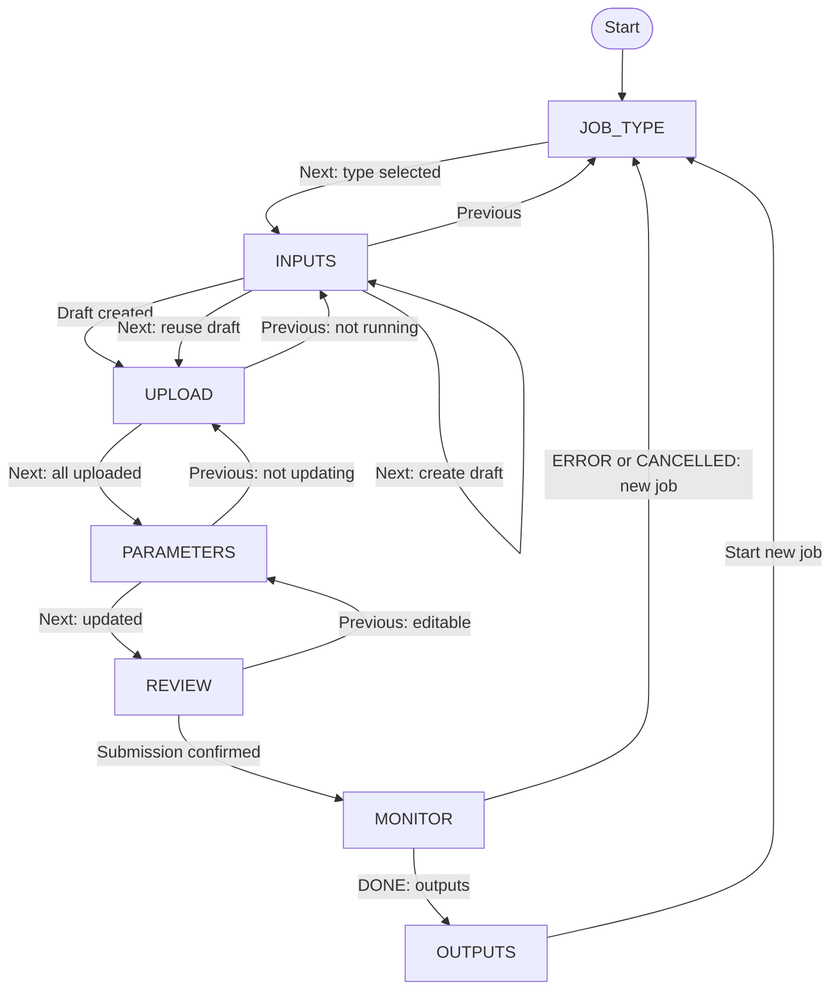
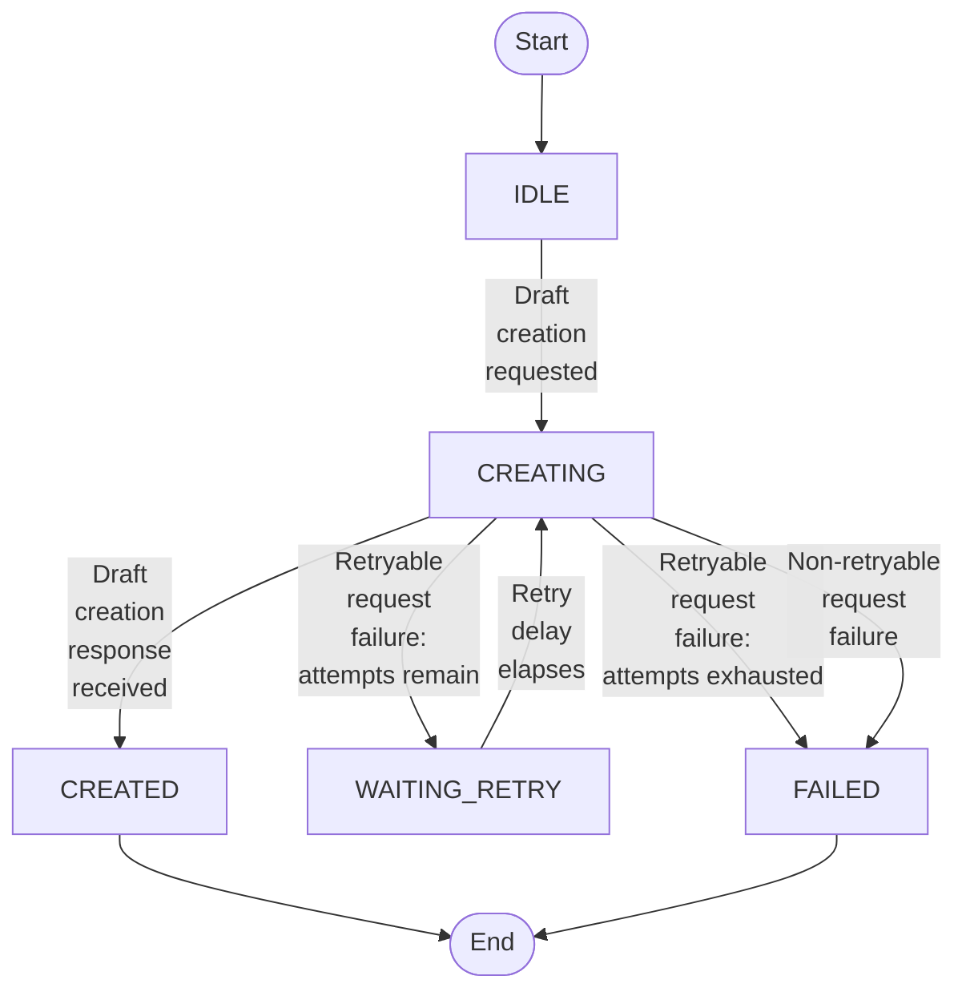

<!--
Copyright (c) 2025 Oleksiy Oleksandrovych Sayankin. All Rights Reserved.
Refer to the LICENSE file in the root directory for full license details.
-->

<!-- TOC -->
* [MDDS Web Client Architecture Specification](#mdds-web-client-architecture-specification)
  * [1. Purpose, scope, and assumptions](#1-purpose-scope-and-assumptions)
  * [2. Document conventions and normative sources](#2-document-conventions-and-normative-sources)
  * [3. Client terminology](#3-client-terminology)
  * [4. Client state composition and ownership](#4-client-state-composition-and-ownership)
  * [5. Global client invariants](#5-global-client-invariants)
  * [6. Common client policies](#6-common-client-policies)
    * [6.1 Asynchronous operation ownership](#61-asynchronous-operation-ownership)
    * [6.2 Request serialization](#62-request-serialization)
    * [6.3 Request failure classification](#63-request-failure-classification)
    * [6.4 Automatic retry](#64-automatic-retry)
    * [6.5 Operation reconciliation](#65-operation-reconciliation)
    * [6.6 User-initiated cancellation](#66-user-initiated-cancellation)
    * [6.7 Stale and late response handling](#67-stale-and-late-response-handling)
    * [6.8 Navigation locking](#68-navigation-locking)
    * [6.9 Warning and error presentation](#69-warning-and-error-presentation)
    * [6.10 Workflow reset and abandonment](#610-workflow-reset-and-abandonment)
  * [7. Network operation catalog](#7-network-operation-catalog)
  * [8. Client state machines](#8-client-state-machines)
    * [8.1 Wizard Navigation](#81-wizard-navigation)
    * [8.2 Draft Job Creation](#82-draft-job-creation)
    * [8.3 Upload Manager](#83-upload-manager)
    * [8.4 Input Slot Lifecycle](#84-input-slot-lifecycle)
    * [8.5 Job Parameter Update](#85-job-parameter-update)
    * [8.6 Job Submission](#86-job-submission)
    * [8.7 Job Monitor](#87-job-monitor)
    * [8.8 Job Cancellation](#88-job-cancellation)
    * [8.9 Output slot Lifecycle](#89-output-slot-lifecycle)
  * [9. Common Wizard Layout](#9-common-wizard-layout)
    * [9.1 Wizard Header](#91-wizard-header)
    * [9.2 Progress Indicator](#92-progress-indicator)
    * [9.3 Step Panel](#93-step-panel)
    * [9.4 Feedback and Notification Region](#94-feedback-and-notification-region)
    * [9.5 Action Bar](#95-action-bar)
    * [9.6 Confirmation Dialogs](#96-confirmation-dialogs)
  * [10. Screen-to-state mapping](#10-screen-to-state-mapping)
    * [10.1 Screen 1: Select Job Type](#101-screen-1-select-job-type)
    * [10.2 Screen 2: Select Job Inputs](#102-screen-2-select-job-inputs)
    * [10.3 Screen 3: Upload Job Inputs](#103-screen-3-upload-job-inputs)
    * [10.4 Screen 4: Set Job Parameters](#104-screen-4-set-job-parameters)
    * [10.5 Screen 5: Review Job Summary](#105-screen-5-review-job-summary)
    * [10.6 Screen 6: Monitor Job Progress](#106-screen-6-monitor-job-progress)
    * [10.7 Screen 7: Download Job Outputs](#107-screen-7-download-job-outputs)
  * [11. Acceptance scenarios](#11-acceptance-scenarios)
  * [12. Deferred decisions and out-of-scope behavior](#12-deferred-decisions-and-out-of-scope-behavior)
<!-- TOC -->


# MDDS Web Client Architecture Specification

## 1. Purpose, scope, and assumptions

- The MDDS Web Client v1 renders SLAE-specific screens.
- All input and output slots declared by a job profile are mandatory.
- Optional artifact slots are not supported.
- The `tolerance` parameter is illustrative and ignored by SLAE execution in v1.
- Restoration of an in-progress wizard after a page reload is out of scope.
- Job cancellation is supported only while the public job status is `IN_PROGRESS`.
- Output download is available only while the public job status is `DONE`.
- An abandoned `DRAFT` job may remain on the server because draft deletion is outside the v1 API.

## 2. Document conventions and normative sources

- Global client invariants are normative.
- State transition tables are normative for local client behavior.
- The network operation catalog is normative for request semantics and recovery strategy.
- The screen-to-state mapping is normative for control visibility and availability.
- State diagrams are explanatory visualizations of the corresponding transition tables.
- Screen sketches and wireframes are illustrative.
- User-visible messages are examples unless explicitly marked as exact.
- A rule must be defined in one authoritative section. Other sections should reference that rule instead of redefining it.

## 3. Client terminology

| Term                   | Meaning                                                                                                               |
|------------------------|-----------------------------------------------------------------------------------------------------------------------|
| `jobStatus`            | The last confirmed public job status obtained from or accepted by the MDDS orchestrator.                              |
| `sessionId`            | Idempotency identifier owned by one Draft Job Creation instance and reused by all automatic retries of that instance. |
| `wizardStep`           | The currently displayed wizard step.                                                                                  |
| `draftCreationState`   | Local state of the draft job creation workflow.                                                                       |
| `uploadManagerState`   | Local state of the current upload queue run.                                                                          |
| `inputSlotState`       | Local state of one declared input slot.                                                                               |
| `parameterUpdateState` | Local state of synchronization between locally edited job parameters and the current server-side `DRAFT` job.         |
| `submissionState`      | Local state of the job submission workflow.                                                                           |
| `monitorState`         | Local state of the job monitoring workflow.                                                                           |
| `cancellationState`    | Local state of the job cancellation workflow.                                                                         |
| `downloadState`        | Local state of one output download workflow.                                                                          |
| `jobProgress`          | The last confirmed job progress value received for the current job, from 0 to 100.                                    |
| `jobMessage`           | The last confirmed public job message received for the current job.                                                   |

## 4. Client state composition and ownership

The client state machines are orthogonal and may have active states at the same time.
For example, the wizard may display the monitoring screen while the public job status is `IN_PROGRESS`, the Job Monitor is `RUNNING`, and Job Cancellation is `RECONCILING`.

The public job lifecycle is owned by the MDDS orchestrator and Worker Runtime and is defined by [MDDS Job Orchestrator Architecture](JOB_ORCHESTRATOR_ARCHITECTURE.md).
The Web Client does not redefine that lifecycle. It stores and renders the last confirmed public `jobStatus` and manages only its local client workflow states.

| State machine        |      Instance count | Scope                                      |
|----------------------|--------------------:|--------------------------------------------|
| Wizard Navigation    |                   1 | Current wizard flow                        |
| Draft Job Creation   |                   1 | Current draft creation workflow            |
| Upload Manager       |                   1 | Current upload queue run                   |
| Input Slot           |  One per input slot | `matrix`, `rhs` in SLAE v1                 |
| Job Parameter Update |                   1 | Current parameter synchronization workflow |
| Job Submission       |                   1 | Current submission workflow                |
| Job Monitor          |                   1 | Current job monitoring workflow            |
| Job Cancellation     |                   1 | Current cancellation workflow              |
| Output Download      | One per output slot | `solution` in SLAE v1                      |

## 5. Global client invariants

| Invariant code | Content                                                                                                                                                                                          |
|----------------|--------------------------------------------------------------------------------------------------------------------------------------------------------------------------------------------------|
| `I1`           | One wizard flow has at most one current `jobId`.                                                                                                                                                 |
| `I2`           | An `UPLOADED` input slot always belongs to the current `jobId`.                                                                                                                                  |
| `I3`           | Every input slot declared by the selected job profile is mandatory.                                                                                                                              |
| `I4`           | Navigation from Screen 3 to Screen 4 is allowed only when every input slot is `UPLOADED`.                                                                                                        |
| `I5`           | After the public job status leaves `DRAFT`, the Web Client must not modify job inputs or parameters.                                                                                             |
| `I6`           | Each asynchronous client workflow may own at most one active HTTP request at a time.                                                                                                             |
| `I7`           | A response belonging to a cancelled, abandoned, or stale client operation must not change the current UI state.                                                                                  |
| `I8`           | `POST /jobs/{jobId}/submit` and `POST /jobs/{jobId}/cancel` must not be repeated automatically after an ambiguous result. Their results must be reconciled through a safe observational request. |
| `I9`           | While job monitoring is active, all `GET /jobs/{jobId}/status` requests are owned and serialized by the Job Monitor.                                                                             |
| `I10`          | The Web Client must not replace the last confirmed public job status with an earlier lifecycle status.                                                                                           |
| `I11`          | Every local non-terminal state must have a defined recovery path or exit path.                                                                                                                   |
| `I12`          | UI controls emit client events. Local workflow states may change only through the transition rules of their owning state machines.                                                               |

## 6. Common client policies

### 6.1 Asynchronous operation ownership

### 6.2 Request serialization

### 6.3 Request failure classification

Request failures are classified for automatic recovery purposes. The classification does not by itself authorize repeating a request.
The operation-specific repeatability and reconciliation rules in the Network Operation Catalog take precedence.

| Failure classification        | Default examples                                                                                                                                                         | Default handling                                                       |
|-------------------------------|--------------------------------------------------------------------------------------------------------------------------------------------------------------------------|------------------------------------------------------------------------|
| Retryable request failure     | Client-side timeout, network failure, connection failure, `408`, `429`, `500`, `502`, `503`, `504`                                                                       | Apply bounded automatic retry when the operation permits it            |
| Non-retryable request failure | Malformed, unsupported, or schema-invalid response, including a successful HTTP response without required fields; `400`, `401`, `403`, `404`, `409`, `415`, `422`, `501` | Do not retry automatically; expose an operation-specific recovery path |

The Network Operation Catalog may override the default classification or require reconciliation instead of repeating the original request.

### 6.4 Automatic retry

Automatic retry is bounded.
All attempts belonging to one operation instance reuse the same request intent and idempotency data.
The retry counter and retry delay belong to the current operation instance. A new operation instance starts with a new retry budget.
If the server returns Retry-After and the operation permits automatic retry, the client should respect that value.
The concrete retry limit and delay strategy are implementation-defined in v1.

### 6.5 Operation reconciliation

### 6.6 User-initiated cancellation

### 6.7 Stale and late response handling

### 6.8 Navigation locking

### 6.9 Warning and error presentation

### 6.10 Workflow reset and abandonment

Resetting or abandoning the current wizard workflow clears the current job context and discards all local state machine instances.

A new wizard workflow creates new state machine instances initialized in their respective initial states.

## 7. Network operation catalog

| Operation                                            |                     Changes server or storage state | Safe to repeat                                  |                 Ambiguous result possible | Recovery strategy                                       |
|------------------------------------------------------|----------------------------------------------------:|-------------------------------------------------|------------------------------------------:|---------------------------------------------------------|
| `POST /jobs`                                         |                                                 Yes | Yes, with the same upload `sessionId`           |                 Controlled by idempotency | Repeat the same `POST /jobs` operation                  |
| `POST /jobs/{jobId}/inputs`                          |                           No; returns an upload URL | Yes                                             |                                        No | Repeat the same URL request                             |
| `PUT <presigned-upload-url>`                         | Yes; creates or replaces the canonical input object | Yes, preferably with a fresh URL                |                                       Yes | Request a fresh upload URL and repeat the `PUT`         |
| `PATCH /jobs/{jobId}/params`                         |                                                 Yes | Yes, with the same JSON Merge Patch document    | Yes, but repeating the same patch is safe | Repeat the same `PATCH` operation                       |
| `POST /jobs/{jobId}/submit`                          |                                                 Yes | No after an ambiguous result                    |                                       Yes | Reconcile through `GET /jobs/{jobId}/status`            |
| `GET /jobs/{jobId}/status`                           |                                                  No | Yes                                             |                                        No | Repeat the same `GET` operation                         |
| `POST /jobs/{jobId}/cancel`                          |                                                 Yes | Do not repeat blindly after an ambiguous result |                                       Yes | Reconcile through `GET /jobs/{jobId}/status`            |
| `GET /jobs/{jobId}/outputs?outputSlot=<output-slot>` |                          No; returns a download URL | Yes                                             |                                        No | Repeat the same output URL request                      |
| `GET <presigned-download-url>`                       |                                                  No | Yes, preferably with a fresh URL                |                                        No | Restart the complete download workflow with a fresh URL |

## 8. Client state machines

Each subsection defines one local state machine. Its transition table is normative.
A state diagram may be added later as an explanatory visualization of the same table.

### 8.1 Wizard Navigation

The Wizard Navigation state machine consists of the following states:

* `JOB_TYPE` — the user selects and stores a supported job type locally;
* `INPUTS` — the user selects a local file for every input slot; the client creates a draft job when the user proceeds to the first upload;
* `UPLOAD` — the server-side `DRAFT` job exists and the client uploads the selected input files, displays upload progress, and allows the user to stop active uploads or retry failed input slots;
* `PARAMETERS` — the user configures job parameters and synchronizes them with the current server-side `DRAFT` job;
* `REVIEW` — the user reviews the selected inputs and parameters before submitting the job for execution;
* `MONITOR` — the client monitors the submitted job, displays its current public status, and allows cancellation while supported;
* `OUTPUTS` — the user may download the output artifacts of a successfully completed job or start a new job.

The table below shows the state transitions of the Wizard Navigation state machine.

| Current state | Event                          | Condition                                                                                                                                           | Side effects                                                                                  | Next state   |
|---------------|--------------------------------|-----------------------------------------------------------------------------------------------------------------------------------------------------|-----------------------------------------------------------------------------------------------|--------------|
| `JOB_TYPE`    | User presses `Next >`          | `jobType` has a valid value                                                                                                                         | Store the selected job type                                                                   | `INPUTS`     |
| `INPUTS`      | User presses `Next >`          | `draftCreationState` == `IDLE` and every declared input slot has `inputSlotState` == `FILE_SELECTED`                                                | Request the current Draft Job Creation instance to create a draft                             | `INPUTS`     |
| `INPUTS`      | User presses `Next >`          | `draftCreationState` == `FAILED` and every declared input slot has `inputSlotState` == `FILE_SELECTED`                                              | Discard the failed instance; create a new Draft Job Creation instance; request draft creation | `INPUTS`     |
| `INPUTS`      | User presses `Next >`          | `draftCreationState` == `CREATED` and `inputSlotState` is one of `FILE_SELECTED`, `UPLOADED`, or `FAILED` for every declared input slot             | Request the Upload Manager to upload every non-`UPLOADED` input slot                          | `UPLOAD`     |
| `INPUTS`      | Draft creation confirmed       | `draftCreationState` == `CREATED` and every declared input slot has `inputSlotState` == `FILE_SELECTED`                                             | Request the Upload Manager to upload every input slot                                         | `UPLOAD`     |
| `INPUTS`      | User presses `< Previous`      | `draftCreationState` is one of `IDLE`, `CREATED` or `FAILED` and `uploadManagerState` is one of `IDLE`, `COMPLETED`, `FAILED`, or `STOPPED_BY_USER` | Abandon the current client workflow and clear the current job context                         | `JOB_TYPE`   |
| `UPLOAD`      | User presses `Next >`          | `uploadManagerState` == `COMPLETED` and every declared input slot has `inputSlotState` == `UPLOADED`                                                | —                                                                                             | `PARAMETERS` |
| `UPLOAD`      | User presses `< Previous`      | `uploadManagerState` is one of `IDLE`, `COMPLETED`, `FAILED` or `STOPPED_BY_USER`                                                                   | —                                                                                             | `INPUTS`     |
| `PARAMETERS`  | User presses `Next >`          | `parameterUpdateState` == `UPDATED`                                                                                                                 | —                                                                                             | `REVIEW`     |
| `PARAMETERS`  | User presses `< Previous`      | `parameterUpdateState` is one of `PENDING`, `UPDATED` or `FAILED`                                                                                   | —                                                                                             | `UPLOAD`     |
| `REVIEW`      | Job submission is confirmed    | `submissionState` == `SUBMITTED` and `jobStatus` != `DRAFT`                                                                                         | Request the Job Monitor to start monitoring the current job                                   | `MONITOR`    |
| `REVIEW`      | User presses `< Previous`      | `jobStatus` == `DRAFT` and `submissionState` is one of `IDLE`, `NOT_SUBMITTED`, `FAILED`                                                            | —                                                                                             | `PARAMETERS` |
| `MONITOR`     | User presses `View outputs >`  | `monitorState` == `COMPLETED` and `jobStatus` == `DONE`                                                                                             | —                                                                                             | `OUTPUTS`    |
| `MONITOR`     | User presses `[Start new job]` | `monitorState` == `COMPLETED` and `jobStatus` is one of `ERROR` or `CANCELLED`                                                                      | Reset the current wizard workflow and initialize a new workflow                               | `JOB_TYPE`   |
| `OUTPUTS`     | User presses `[Start new job]` | `jobStatus` == `DONE`                                                                                                                               | Reset the current wizard workflow and initialize a new workflow                               | `JOB_TYPE`   |

Initial and terminal states are described in the table below.

| State type | State Name |
|------------|------------|
| Initial    | `JOB_TYPE` |
| Terminal   | —          |




### 8.2 Draft Job Creation

The Draft Job Creation state machine consists of the following states:

* `IDLE` — No draft creation request has started for this state machine instance;
* `CREATING` — One `POST /jobs` request is active;
* `WAITING_RETRY` — No HTTP request is active. The workflow is waiting for the configured retry delay to expire;
* `CREATED` — The server-side `DRAFT` job is confirmed and its `jobId` is stored in the current wizard context;
* `FAILED` — Draft creation ended without a confirmed job and no automatic retry is pending. This state is terminal. The user may start a new Draft Job Creation operation or abandon the current workflow.

The table below shows the state transitions of the Draft Job Creation state machine. The initial state is `IDLE`.

| Current state   | Event                            | Condition                                                                 | Side effects                                                                                                            | Next state      |
|-----------------|----------------------------------|---------------------------------------------------------------------------|-------------------------------------------------------------------------------------------------------------------------|-----------------|
| `IDLE`          | Draft creation requested         | No current `jobId`                                                        | Send `POST /jobs` using the current `jobType` and `sessionId`                                                           | `CREATING`      |
| `CREATING`      | Draft creation response received | A valid `200 OK` or `201 Created` response contains the confirmed `jobId` | Store `jobId`; set the last confirmed `jobStatus` to `DRAFT`; after entering `CREATED`, emit `Draft creation confirmed` | `CREATED`       |
| `CREATING`      | Retryable request failure        | Automatic retry attempts remain                                           | Schedule the next attempt using the configured retry delay                                                              | `WAITING_RETRY` |
| `CREATING`      | Retryable request failure        | Automatic retry attempts are exhausted                                    | Store failure details and expose a workflow recovery action                                                             | `FAILED`        |
| `CREATING`      | Non-retryable request failure    | —                                                                         | Store failure details and expose an operation-specific error                                                            | `FAILED`        |
| `WAITING_RETRY` | Retry delay elapses              | The operation still belongs to the current workflow                       | Repeat `POST /jobs` using the same `jobType`, `sessionId`, and request intent                                           | `CREATING`      |


Initial and terminal states are described in the table below.

| State type | State Name          |
|------------|---------------------|
| Initial    | `IDLE`              |
| Terminal   | `CREATED`, `FAILED` |

Each Draft Job Creation instance owns one `sessionId`. All automatic retries within the instance reuse the same `jobType`, `sessionId`, and request intent. A new instance receives a new `sessionId`.
Each Draft Job Creation state machine instance represents one logical draft creation operation.
The current Draft Job Creation state machine instance remains in its terminal state until it is replaced by a new instance or discarded with the current wizard workflow.



### 8.3 Upload Manager

| Current state | Event                            | Condition                     | Side effects                                                                         | Next state        |
|---------------|----------------------------------|-------------------------------|--------------------------------------------------------------------------------------|-------------------|
| `RUNNING`     | Queue exhausted                  | —                             | —                                                                                    | `COMPLETED`       |
| `RUNNING`     | Fatal upload URL request failure | —                             | Current slot → `FAILED`; discard the remaining queue                                 | `FAILED`          |
| `RUNNING`     | User confirms stop               | —                             | Abort the active request; active slot → `FILE_SELECTED`; discard the remaining queue | `STOPPED_BY_USER` |
| `COMPLETED`   | Retry failed slots               | At least one slot is `FAILED` | Build a queue from the failed slots                                                  | `RUNNING`         |

```text
IDLE
RUNNING
COMPLETED
FAILED
STOPPED_BY_USER
```

### 8.4 Input Slot Lifecycle

| Current state   | Event                     | Condition                        | Side effects                                             | Next state      |
|-----------------|---------------------------|----------------------------------|----------------------------------------------------------|-----------------|
| `EMPTY`         | User selects a file       | —                                | Store the selected local file                            | `FILE_SELECTED` |
| `FILE_SELECTED` | User selects another file | —                                | Replace the previously selected file                     | `FILE_SELECTED` |
| `FILE_SELECTED` | Upload starts             | —                                | Start the input slot upload workflow                     | `UPLOADING`     |
| `UPLOADING`     | Upload succeeds           | —                                | Associate the uploaded artifact with the current `jobId` | `UPLOADED`      |
| `UPLOADING`     | Upload fails              | —                                | Preserve the selected file for retry                     | `FAILED`        |
| `FAILED`        | Upload retry starts       | Selected file is still available | Start another upload attempt                             | `UPLOADING`     |
| `FAILED`        | User selects another file | —                                | Replace the selected file                                | `FILE_SELECTED` |
| `UPLOADED`      | User selects another file | Job is still `DRAFT`             | Mark the new local file as not uploaded                  | `FILE_SELECTED` |

```text
EMPTY
FILE_SELECTED
UPLOADING
UPLOADED
FAILED
```

### 8.5 Job Parameter Update

| Current state | Event | Condition | Side effects | Next state |
|---------------|-------|-----------|--------------|------------|

```text
PENDING
UPDATING
UPDATED
FAILED
```

### 8.6 Job Submission

| Current state | Event | Condition | Side effects | Next state |
|---------------|-------|-----------|--------------|------------|

```text
IDLE
SUBMITTING
RECONCILING
SUBMITTED
NOT_SUBMITTED
UNKNOWN
FAILED
```

### 8.7 Job Monitor

| Current state | Event | Condition | Side effects | Next state |
|---------------|-------|-----------|--------------|------------|

```text
IDLE
RUNNING
COMPLETED
FAILED
```

### 8.8 Job Cancellation

| Current state | Event                       | Condition                    | Side effects              | Next state   |
|---------------|-----------------------------|------------------------------|---------------------------|--------------|
| `IDLE`        | User presses `[Cancel job]` | `jobStatus` == `IN_PROGRESS` | Open confirmation dialog  | `CONFIRMING` |
| `CONFIRMING`  | User dismisses confirmation | —                            | Close confirmation dialog | `IDLE`       |
| `CONFIRMING`  | User confirms cancellation  | `jobStatus` == `IN_PROGRESS` | Send cancellation request | `REQUESTING` |

```text
IDLE
CONFIRMING
REQUESTING
RECONCILING
ACCEPTED
NOT_ACCEPTED
FAILED
```

### 8.9 Output slot Lifecycle

| Current state | Event | Condition | Side effects | Next state |
|---------------|-------|-----------|--------------|------------|

```text
IDLE
REQUESTING_URL
DOWNLOADING
DOWNLOADED
FAILED_DOWNLOAD
CANCELLED_DOWNLOAD
```

## 9. Common Wizard Layout

This section defines the common functional regions of every wizard step.
The diagrams illustrate their relative composition and do not prescribe exact dimensions, spacing, styling, or responsive placement.
The diagram below shows the common wizard window structure.

```text
┌────────────────────────────────────────────────────────────────────────┐
│  Wizard Header                                                         │
│                                                                        │
├────────────────────────────────────────────────────────────────────────┤
│    Progress Indicator                                                  │
│  ┌──────────────────────────────────────────────────────────────────┐  │
│  │  Step Panel                                          Step n of N │  │
│  │                                                                  │  │
│  │                                                                  │  │
│  │                                                                  │  │
│  │                                                                  │  │
│  ├──────────────────────────────────────────────────────────────────┤  │
│  │  Feedback and Notification Region                                │  │
│  └──────────────────────────────────────────────────────────────────┘  │
│                                                           Action Bar   │
└────────────────────────────────────────────────────────────────────────┘
```

### 9.1 Wizard Header

The header is shared by all wizard steps.

```text
┌────────────────────────────────────────────────────────────────────────┐
│ MDDS Job Wizard                                                        │
│ Create, configure, submit, and monitor an MDDS job                     │
└────────────────────────────────────────────────────────────────────────┘
```

### 9.2 Progress Indicator

Step labels are not clickable.

```text
┌────────────────────────────────────────────────────────────────────────┐
│  Job type → Inputs → Upload → Parameters → Review → Monitor → Outputs  │
│    (*)                                                                 │
└────────────────────────────────────────────────────────────────────────┘
```

### 9.3 Step Panel

The wizard step panel displays the content of the current step.

```text
┌──────────────────────────────────────────────────────────────────┐ 
│  Select Job Type                                     Step 1 of 7 │
│                                                                  │
│  Job Type: [ solving_slae ▼ ]                                    │
│                                                                  │
│                                                                  │
└──────────────────────────────────────────────────────────────────┘ 
```

### 9.4 Feedback and Notification Region

```text
┌──────────────────────────────────────────────────────────────────┐ 
│     Status, warning, and error messages appear here              │
└──────────────────────────────────────────────────────────────────┘
```

### 9.5 Action Bar

The action bar contains the primary action for the current step and any available backward, secondary, or workflow-level actions.

```text
┌────────────────────────────────────────────────────────────────────────┐ 
│   < Previous                                                   Next >  │
└────────────────────────────────────────────────────────────────────────┘
```

### 9.6 Confirmation Dialogs

```text
┌────────────────────────────────────────────────┐
│           Confirmation question                │
│                                                │
│   [the first choice]     [the second choice]   │
└────────────────────────────────────────────────┘
```

## 10. Screen-to-state mapping

This section maps local client states to visible content, control availability,
and generated client events. It does not redefine state transitions or network
recovery policies.

### 10.1 Screen 1: Select Job Type


```text
┌────────────────────────────────────────────────────────────────────────┐
│ MDDS Job Wizard                                                        │
│ Create, configure, submit, and monitor an MDDS job                     │
├────────────────────────────────────────────────────────────────────────┤
│  Job type → Inputs → Upload → Parameters → Review → Monitor → Outputs  │
│     (*)                                                                │
│                                                                        │
│  ┌──────────────────────────────────────────────────────────────────┐  │
│  │  Select Job Type                                     Step 1 of 7 │  │
│  │                                                                  │  │
│  │  Job Type: [ solving_slae ▼ ]                                    │  │
│  │                                                                  │  │
│  │                                                                  │  │
│  ├──────────────────────────────────────────────────────────────────┤  │
│  │                                                                  │  │
│  └──────────────────────────────────────────────────────────────────┘  │
│                                                                Next >  │
└────────────────────────────────────────────────────────────────────────┘
```


### 10.2 Screen 2: Select Job Inputs

```text
┌────────────────────────────────────────────────────────────────────────┐
│ MDDS Job Wizard                                                        │
│ Create, configure, submit, and monitor an MDDS job                     │
├────────────────────────────────────────────────────────────────────────┤
│  Job type → Inputs → Upload → Parameters → Review → Monitor → Outputs  │
│               (*)                                                      │
│                                                                        │
│  ┌──────────────────────────────────────────────────────────────────┐  │
│  │  Select Job Inputs                                   Step 2 of 7 │  │
│  │                                                                  │  │
│  │  Matrix   : file1.csv  [Choose file]                             │  │
│  │  RHS      : file2.csv  [Choose file]                             │  │
│  │                                                                  │  │
│  ├──────────────────────────────────────────────────────────────────┤  │
│  │                                                                  │  │
│  └──────────────────────────────────────────────────────────────────┘  │
│   < Previous                                                   Next >  │
└────────────────────────────────────────────────────────────────────────┘
```

### 10.3 Screen 3: Upload Job Inputs


```text
┌────────────────────────────────────────────────────────────────────────┐
│ MDDS Job Wizard                                                        │
│ Create, configure, submit, and monitor an MDDS job                     │
├────────────────────────────────────────────────────────────────────────┤
│  Job type → Inputs → Upload → Parameters → Review → Monitor → Outputs  │
│                       (*)                                              │
│                                                                        │
│  ┌──────────────────────────────────────────────────────────────────┐  │
│  │  Upload Job Inputs                                   Step 3 of 7 │  │
│  │                                                                  │  │
│  │  Matrix    matrix.csv    Uploaded                                │  │
│  │  RHS       rhs.csv       Uploading...                            │  │
│  │                                                                  │  │
│  │                         (Stop uploading)  (Retry failed uploads) │  │
│  ├──────────────────────────────────────────────────────────────────┤  │
│  │  Uploading input files...                                        │  │
│  └──────────────────────────────────────────────────────────────────┘  │
│   < Previous                                                   Next >  │
└────────────────────────────────────────────────────────────────────────┘
```

> `(Retry failed uploads)` is disabled since there is no failed file uploads.

> `< Previous` and `Next >` are disabled while uploads are running.

```text
┌────────────────────────────────────────────────┐
│  Stop uploading and return to file selection?  │
│                                                │
│    [Continue uploading]     [Stop upload]      │
└────────────────────────────────────────────────┘
```

### 10.4 Screen 4: Set Job Parameters


```text
┌────────────────────────────────────────────────────────────────────────┐
│ MDDS Job Wizard                                                        │
│ Create, configure, submit, and monitor an MDDS job                     │
├────────────────────────────────────────────────────────────────────────┤
│  Job type → Inputs → Upload → Parameters → Review → Monitor → Outputs  │
│                                  (*)                                   │
│                                                                        │
│  ┌──────────────────────────────────────────────────────────────────┐  │
│  │  Set Job Parameters                                  Step 4 of 7 │  │
│  │                                                                  │  │
│  │  Solving method *    [numpy_exact_solver ▼]                      │  │
│  │                                                                  │  │
│  │                                                                  │  │
│  │                                                                  │  │
│  │                                                                  │  │
│  ├──────────────────────────────────────────────────────────────────┤  │
│  │  Network error while updating job parameters                     │  │
│  └──────────────────────────────────────────────────────────────────┘  │
│   < Previous                                                   Next >  │
└────────────────────────────────────────────────────────────────────────┘
```


### 10.5 Screen 5: Review Job Summary

```text
┌────────────────────────────────────────────────────────────────────────┐
│ MDDS Job Wizard                                                        │
│ Create, configure, submit, and monitor an MDDS job                     │
├────────────────────────────────────────────────────────────────────────┤
│  Job type → Inputs → Upload → Parameters → Review → Monitor → Outputs  │
│                                              (*)                       │
│                                                                        │
│  ┌──────────────────────────────────────────────────────────────────┐  │
│  │  Review Job Summary                                  Step 5 of 7 │  │
│  │                                                                  │  │
│  │  Job type                                                        │  │
│  │  solving_slae                                                    │  │
│  │                                                                  │  │
│  │  Inputs                                                          │  │
│  │  ✓ Matrix    matrix.csv                                          │  │
│  │  ✓ RHS       rhs.csv                                             │  │
│  │                                                                  │  │
│  │  Parameters                                                      │  │
│  │  Solving method    numpy_exact_solver                            │  │
│  ├──────────────────────────────────────────────────────────────────┤  │
│  │  Network error while submitting the job                          │  │
│  └──────────────────────────────────────────────────────────────────┘  │
│   < Previous                                             [Submit job]  │
└────────────────────────────────────────────────────────────────────────┘
```


### 10.6 Screen 6: Monitor Job Progress

```text
┌────────────────────────────────────────────────────────────────────────┐
│ MDDS Job Wizard                                                        │
│ Create, configure, submit, and monitor an MDDS job                     │
├────────────────────────────────────────────────────────────────────────┤
│  Job type → Inputs → Upload → Parameters → Review → Monitor → Outputs  │
│                                                       (*)              │
│                                                                        │
│  ┌──────────────────────────────────────────────────────────────────┐  │
│  │  Monitor Job Progress                                Step 6 of 7 │  │
│  │                                                                  │  │
│  │  Status : IN_PROGRESS                                            │  │
│  │                                                                  │  │
│  │  Estimated progress: [████████████████░░░░] 78%                  │  │
│  │                                                                  │  │
│  │  Message : Worker is processing job                              │  │
│  │                                                                  │  │
│  │                                                     (Cancel job) │  │
│  ├──────────────────────────────────────────────────────────────────┤  │
│  │                                                                  │  │
│  │                                                                  │  │
│  └──────────────────────────────────────────────────────────────────┘  │
│                                                        View outputs >  │
└────────────────────────────────────────────────────────────────────────┘
```

> Button `View outputs >` is disabled since Job is in progress.


```text
┌──────────────────────────────┐
│   Cancel this running job?   │
│                              │
│ [Keep running]  [Cancel job] │
└──────────────────────────────┘
```

### 10.7 Screen 7: Download Job Outputs

```text
┌────────────────────────────────────────────────────────────────────────┐
│ MDDS Job Wizard                                                        │
│ Create, configure, submit, and monitor an MDDS job                     │
├────────────────────────────────────────────────────────────────────────┤
│  Job type → Inputs → Upload → Parameters → Review → Monitor → Outputs  │
│                                                                 (*)    │
│                                                                        │
│  ┌──────────────────────────────────────────────────────────────────┐  │
│  │  Download Job Outputs                                Step 7 of 7 │  │
│  │                                                                  │  │
│  │  Solution    CSV    [Download]                                   │  │
│  │                                                                  │  │
│  │                                                                  │  │
│  ├──────────────────────────────────────────────────────────────────┤  │
│  │                                                                  │  │
│  └──────────────────────────────────────────────────────────────────┘  │
│                                                    [Start new job]     │
└────────────────────────────────────────────────────────────────────────┘
```


## 11. Acceptance scenarios

| Given                                         | When                                  | Then                                                                                                                   |
|-----------------------------------------------|---------------------------------------|------------------------------------------------------------------------------------------------------------------------|
| The current `submissionState` is `SUBMITTING` | `POST /jobs/{jobId}/submit` times out | The client must not repeat the submit request; it must enter `RECONCILING`; it must request `GET /jobs/{jobId}/status` |

## 12. Deferred decisions and out-of-scope behavior
