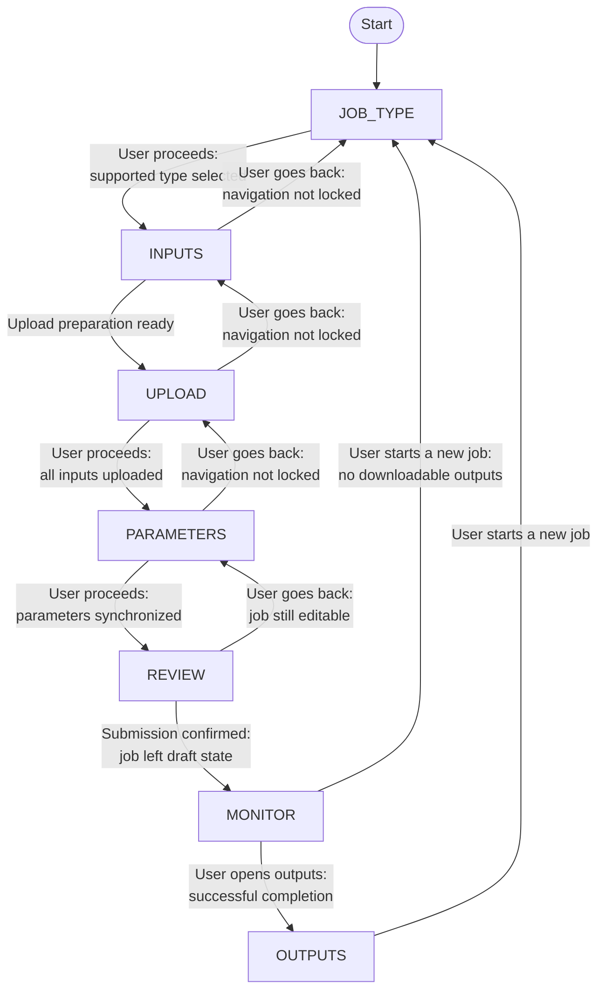
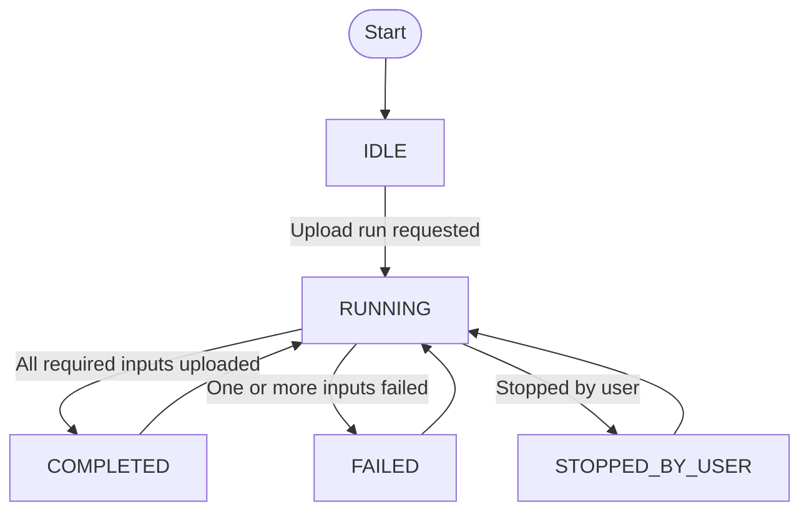
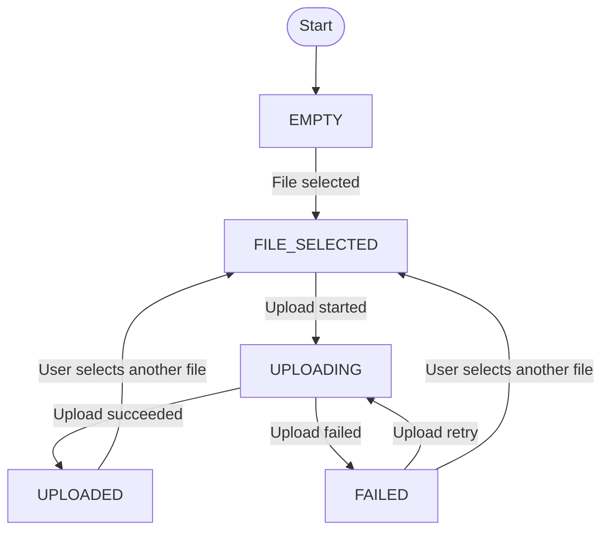
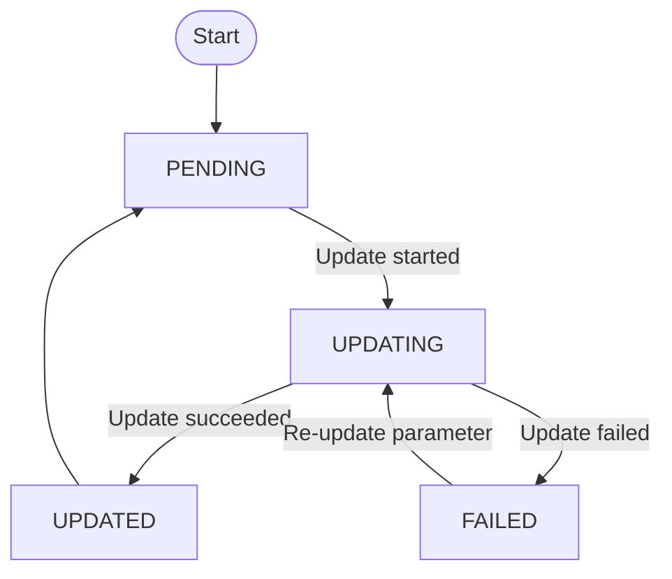
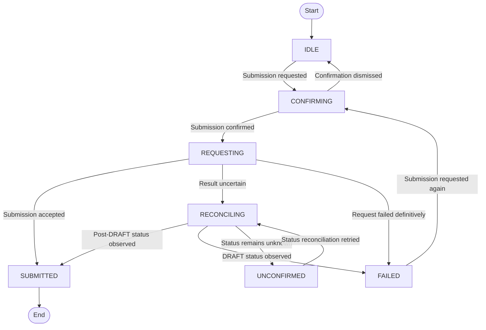
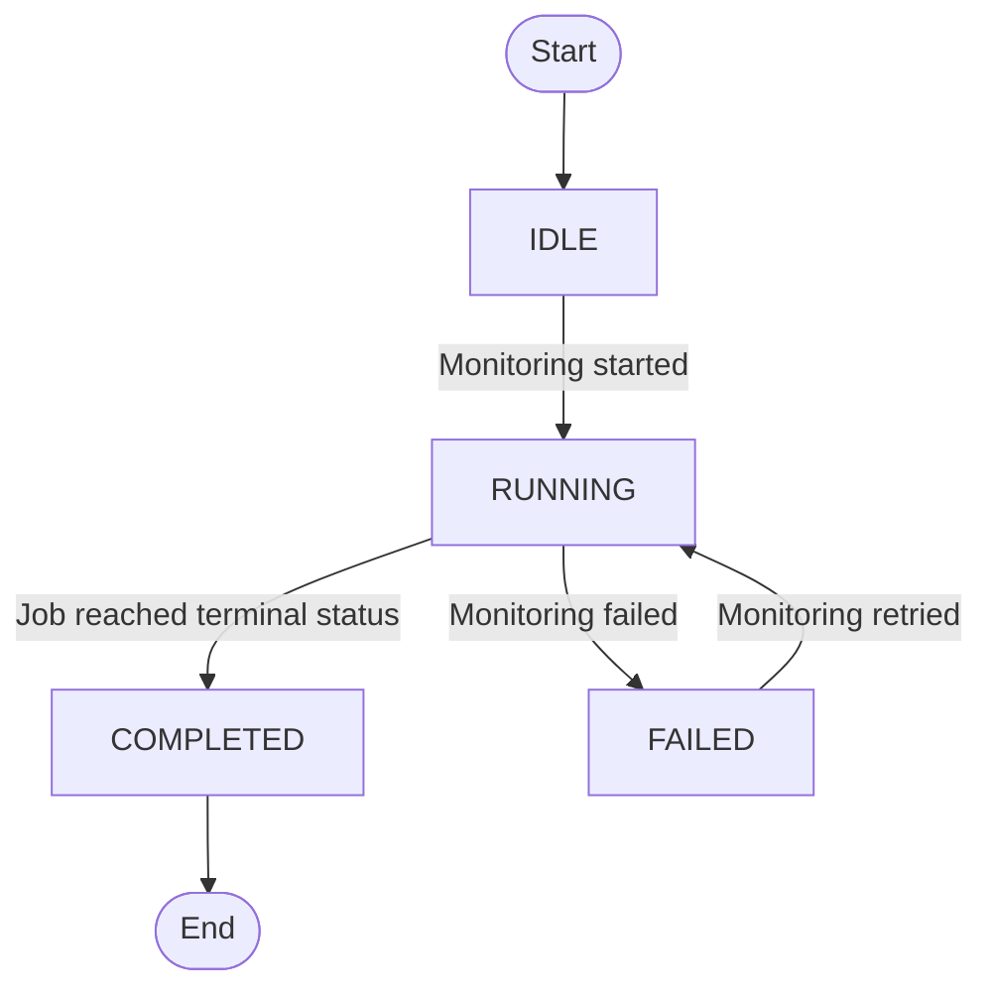
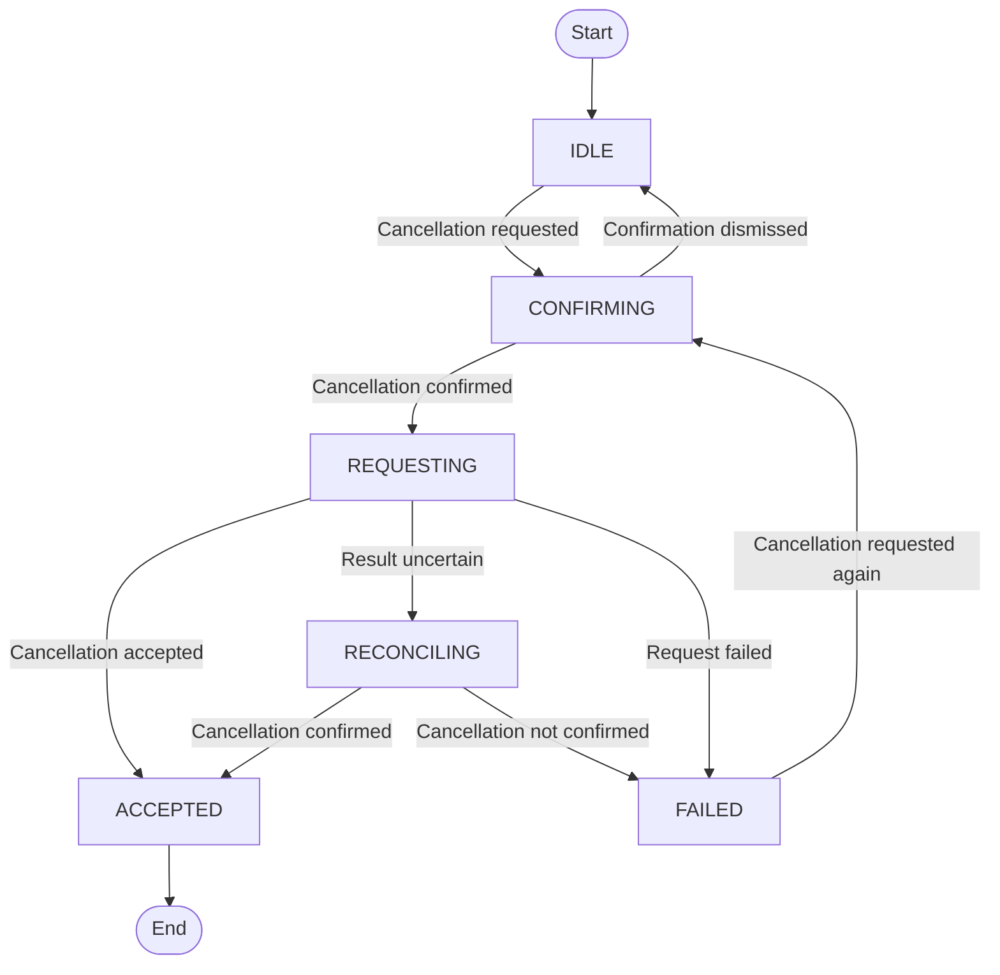
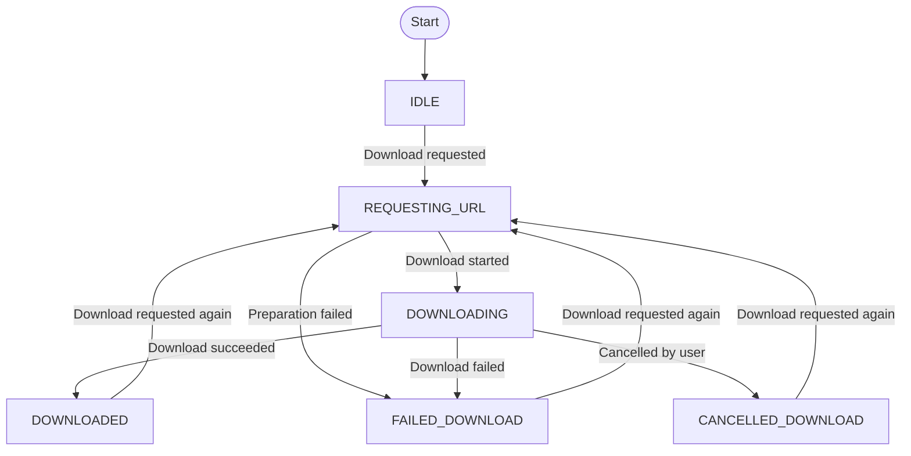

<!--
Copyright (c) 2025 Oleksiy Oleksandrovych Sayankin. All Rights Reserved.
Refer to the LICENSE file in the root directory for full license details.
-->

<!-- TOC -->
* [MDDS Web Client Architecture Specification](#mdds-web-client-architecture-specification)
  * [1. Purpose, scope, and assumptions](#1-purpose-scope-and-assumptions)
  * [2. Document conventions and normative sources](#2-document-conventions-and-normative-sources)
  * [3. Client terminology](#3-client-terminology)
  * [4. Client state composition and ownership](#4-client-state-composition-and-ownership)
  * [5. Global client invariants](#5-global-client-invariants)
  * [6. Common client policies](#6-common-client-policies)
    * [6.1 Asynchronous operation ownership](#61-asynchronous-operation-ownership)
    * [6.2 Request serialization](#62-request-serialization)
    * [6.3 Request failure classification](#63-request-failure-classification)
    * [6.4 Automatic retry](#64-automatic-retry)
    * [6.5 Operation reconciliation](#65-operation-reconciliation)
    * [6.6 User-initiated cancellation](#66-user-initiated-cancellation)
    * [6.7 Stale and late response handling](#67-stale-and-late-response-handling)
    * [6.8 Navigation locking](#68-navigation-locking)
    * [6.9 Warning and error presentation](#69-warning-and-error-presentation)
    * [6.10 Workflow reset and abandonment](#610-workflow-reset-and-abandonment)
  * [7. Network operation catalog](#7-network-operation-catalog)
  * [8. Client state machines](#8-client-state-machines)
    * [8.1 Wizard Navigation](#81-wizard-navigation)
    * [8.2 Draft Job Creation](#82-draft-job-creation)
    * [8.3 Upload Manager](#83-upload-manager)
    * [8.4 Input Slot Lifecycle](#84-input-slot-lifecycle)
    * [8.5 Job Parameter Update](#85-job-parameter-update)
    * [8.6 Job Submission](#86-job-submission)
    * [8.7 Job Monitor](#87-job-monitor)
    * [8.8 Job Cancellation](#88-job-cancellation)
    * [8.9 Output Slot Lifecycle](#89-output-slot-lifecycle)
  * [9. Common Wizard Layout](#9-common-wizard-layout)
    * [9.1 Wizard Header](#91-wizard-header)
    * [9.2 Progress Indicator](#92-progress-indicator)
    * [9.3 Step Panel](#93-step-panel)
    * [9.4 Feedback and Notification Region](#94-feedback-and-notification-region)
    * [9.5 Action Bar](#95-action-bar)
    * [9.6 Confirmation Dialogs](#96-confirmation-dialogs)
  * [10. Screen-to-state mapping](#10-screen-to-state-mapping)
    * [10.1 Screen 1: Select Job Type](#101-screen-1-select-job-type)
    * [10.2 Screen 2: Select Job Inputs](#102-screen-2-select-job-inputs)
    * [10.3 Screen 3: Upload Job Inputs](#103-screen-3-upload-job-inputs)
    * [10.4 Screen 4: Set Job Parameters](#104-screen-4-set-job-parameters)
    * [10.5 Screen 5: Review Job Summary](#105-screen-5-review-job-summary)
    * [10.6 Screen 6: Monitor Job Progress](#106-screen-6-monitor-job-progress)
    * [10.7 Screen 7: Download Job Outputs](#107-screen-7-download-job-outputs)
<!-- TOC -->


# MDDS Web Client Architecture Specification

## 1. Purpose, scope, and assumptions

- The MDDS Web Client v1 renders SLAE-specific screens.
- All input and output slots declared by a job profile are mandatory.
- Optional artifact slots are not supported.
- The `tolerance` parameter is illustrative and ignored by SLAE execution in v1.
- Restoration of an in-progress wizard after a page reload is out of scope.
- Job cancellation is supported only while the public job status is `IN_PROGRESS`.
- Output download is available only while the public job status is `DONE`.
- An abandoned `DRAFT` job may remain on the server because draft deletion is outside the v1 API.

## 2. Document conventions and normative sources

- Global client invariants are normative.
- State transition tables are normative for local client behavior.
- The network operation catalog is normative for request semantics and recovery strategy.
- The screen-to-state mapping is normative for control visibility and availability.
- State diagrams are explanatory visualizations of the corresponding transition tables.
- Screen sketches and wireframes are illustrative.
- User-visible messages are examples unless explicitly marked as exact.
- A rule must be defined in one authoritative section. Other sections should reference that rule instead of redefining it.

## 3. Client terminology

| Term                   | Meaning                                                                                                               |
|------------------------|-----------------------------------------------------------------------------------------------------------------------|
| `jobStatus`            | The last confirmed public job status obtained from or accepted by the MDDS orchestrator.                              |
| `sessionId`            | Idempotency identifier owned by one Draft Job Creation instance and reused by all automatic retries of that instance. |
| `wizardStep`           | The currently displayed wizard step.                                                                                  |
| `draftCreationState`   | Local state of the draft job creation workflow.                                                                       |
| `uploadManagerState`   | Local state of the current upload queue run.                                                                          |
| `inputSlotState`       | Local state of one declared input slot.                                                                               |
| `parameterUpdateState` | Local state of synchronization between locally edited job parameters and the current server-side `DRAFT` job.         |
| `submissionState`      | Local state of the job submission workflow.                                                                           |
| `monitorState`         | Local state of the job monitoring workflow.                                                                           |
| `cancellationState`    | Local state of the job cancellation workflow.                                                                         |
| `downloadState`        | Local state of one output download workflow.                                                                          |
| `jobProgress`          | The last confirmed job progress value received for the current job, from 0 to 100.                                    |
| `jobMessage`           | The last confirmed public job message received for the current job.                                                   |

## 4. Client state composition and ownership

The client state machines are orthogonal and may have active states at the same time.
For example, the wizard may display the monitoring screen while the public job status is `IN_PROGRESS`, the Job Monitor is `RUNNING`, and Job Cancellation is `RECONCILING`.

The public job lifecycle is owned by the MDDS orchestrator and Worker Runtime and is defined by [MDDS Job Orchestrator Architecture](JOB_ORCHESTRATOR_ARCHITECTURE.md).
The Web Client does not redefine that lifecycle. It stores and renders the last confirmed public `jobStatus` and manages only its local client workflow states.

| State machine        |      Instance count | Scope                                      |
|----------------------|--------------------:|--------------------------------------------|
| Wizard Navigation    |                   1 | Current wizard flow                        |
| Draft Job Creation   |                   1 | Current draft creation workflow            |
| Upload Manager       |                   1 | Current upload queue run                   |
| Input Slot           |  One per input slot | `matrix`, `rhs` in SLAE v1                 |
| Job Parameter Update |                   1 | Current parameter synchronization workflow |
| Job Submission       |                   1 | Current submission workflow                |
| Job Monitor          |                   1 | Current job monitoring workflow            |
| Job Cancellation     |                   1 | Current cancellation workflow              |
| Output Download      | One per output slot | `solution` in SLAE v1                      |

## 5. Global client invariants

| Invariant code | Content                                                                                                                                                                                          |
|----------------|--------------------------------------------------------------------------------------------------------------------------------------------------------------------------------------------------|
| `I1`           | One wizard flow has at most one current `jobId`.                                                                                                                                                 |
| `I2`           | An `UPLOADED` input slot always belongs to the current `jobId`.                                                                                                                                  |
| `I3`           | Every input slot declared by the selected job profile is mandatory.                                                                                                                              |
| `I4`           | Navigation from Screen 3 to Screen 4 is allowed only when every input slot is `UPLOADED`.                                                                                                        |
| `I5`           | After the public job status leaves `DRAFT`, the Web Client must not modify job inputs or parameters.                                                                                             |
| `I6`           | Each asynchronous client workflow may own at most one active HTTP request at a time.                                                                                                             |
| `I7`           | A response belonging to a cancelled, abandoned, or stale client operation must not change the current UI state.                                                                                  |
| `I8`           | `POST /jobs/{jobId}/submit` and `POST /jobs/{jobId}/cancel` must not be repeated automatically after an ambiguous result. Their results must be reconciled through a safe observational request. |
| `I9`           | While job monitoring is active, all `GET /jobs/{jobId}/status` requests are owned and serialized by the Job Monitor.                                                                             |
| `I10`          | The Web Client must not replace the last confirmed public job status with an earlier lifecycle status.                                                                                           |
| `I11`          | Every local non-terminal state must have a defined recovery path or exit path.                                                                                                                   |
| `I12`          | UI controls emit client events. Local workflow states may change only through the transition rules of their owning state machines.                                                               |

## 6. Common client policies

### 6.1 Asynchronous operation ownership

Each asynchronous operation is owned by the workflow instance that started it. Only that owner may process the operation result, retry it, cancel it, or update the corresponding local workflow state.

### 6.2 Request serialization

A workflow instance must not start a new HTTP request while it already owns an active request. Job Monitor status requests are single-flight: the next polling request may start only after the previous request has completed and the polling delay has elapsed.

### 6.3 Request failure classification

Request failures are classified for automatic recovery purposes. The classification does not by itself authorize repeating a request.
The operation-specific repeatability and reconciliation rules in the Network Operation Catalog take precedence.

| Failure classification        | Default examples                                                                                                                                                         | Default handling                                                       |
|-------------------------------|--------------------------------------------------------------------------------------------------------------------------------------------------------------------------|------------------------------------------------------------------------|
| Retryable request failure     | Client-side timeout, network failure, connection failure, `408`, `429`, `500`, `502`, `503`, `504`                                                                       | Apply bounded automatic retry when the operation permits it            |
| Non-retryable request failure | Malformed, unsupported, or schema-invalid response, including a successful HTTP response without required fields; `400`, `401`, `403`, `404`, `409`, `415`, `422`, `501` | Do not retry automatically; expose an operation-specific recovery path |

The Network Operation Catalog may override the default classification or require reconciliation instead of repeating the original request.

### 6.4 Automatic retry

Automatic retry is bounded.
All attempts belonging to one operation instance reuse the same request intent and idempotency data.
The retry counter and retry delay belong to the current operation instance. A new operation instance starts with a new retry budget.
If the server returns Retry-After and the operation permits automatic retry, the client should respect that value.
The concrete retry limit and delay strategy are implementation-defined in v1.

### 6.5 Operation reconciliation

When the result of a non-repeatable state-changing request is ambiguous, the client must not repeat the original request. It must determine the outcome through the observational operation defined in the Network Operation Catalog and keep the original workflow blocked until reconciliation succeeds or reaches a defined unresolved state.

### 6.6 User-initiated cancellation

Cancelling a client-side operation stops or abandons only the corresponding local request, upload, or download workflow. It does not imply that a server-side operation was rolled back; cancellation of a running job is performed only through the Job Cancellation state machine.

### 6.7 Stale and late response handling

Each asynchronous operation must have an identity associated with its owning workflow instance and current job context. A response may update client state only while that identity is still current; responses from replaced, cancelled, reset, or abandoned operations must be ignored.

### 6.8 Navigation locking

Navigation is locked while leaving the current step could abandon an active workflow or make the displayed state inconsistent with the current job context. Navigation locking must not disable an explicit stop, cancel, retry, or reconciliation action provided by the owning workflow.

### 6.9 Warning and error presentation

Warnings and errors are owned by the workflow that produced them and are displayed in the common Feedback and Notification Region. A failure must not remove the last successfully confirmed job status, progress, or data, and its message remains visible until the workflow is retried, reset, or successfully recovered.

### 6.10 Workflow reset and abandonment

Resetting or abandoning the current wizard workflow clears the current job context and discards all local state machine instances.

A new wizard workflow creates new state machine instances initialized in their respective initial states.

## 7. Network operation catalog

| Operation                                            |                     Changes server or storage state | Safe to repeat                                  |                 Ambiguous result possible | Recovery strategy                                       |
|------------------------------------------------------|----------------------------------------------------:|-------------------------------------------------|------------------------------------------:|---------------------------------------------------------|
| `POST /jobs`                                         |                                                 Yes | Yes, with the same upload `sessionId`           |                 Controlled by idempotency | Repeat the same `POST /jobs` operation                  |
| `POST /jobs/{jobId}/inputs`                          |                           No; returns an upload URL | Yes                                             |                                        No | Repeat the same URL request                             |
| `PUT <presigned-upload-url>`                         | Yes; creates or replaces the canonical input object | Yes, preferably with a fresh URL                |                                       Yes | Request a fresh upload URL and repeat the `PUT`         |
| `PATCH /jobs/{jobId}/params`                         |                                                 Yes | Yes, with the same JSON Merge Patch document    | Yes, but repeating the same patch is safe | Repeat the same `PATCH` operation                       |
| `POST /jobs/{jobId}/submit`                          |                                                 Yes | No after an ambiguous result                    |                                       Yes | Reconcile through `GET /jobs/{jobId}/status`            |
| `GET /jobs/{jobId}/status`                           |                                                  No | Yes                                             |                                        No | Repeat the same `GET` operation                         |
| `POST /jobs/{jobId}/cancel`                          |                                                 Yes | Do not repeat blindly after an ambiguous result |                                       Yes | Reconcile through `GET /jobs/{jobId}/status`            |
| `GET /jobs/{jobId}/outputs?outputSlot=<output-slot>` |                          No; returns a download URL | Yes                                             |                                        No | Repeat the same output URL request                      |
| `GET <presigned-download-url>`                       |                                                  No | Yes, preferably with a fresh URL                |                                        No | Restart the complete download workflow with a fresh URL |

## 8. Client state machines

Each subsection defines one local state machine. Its transition table is normative.
A state diagram may be added later as an explanatory visualization of the same table.

### 8.1 Wizard Navigation

The Wizard Navigation state machine owns only the currently displayed wizard step. 
It does not define the internal behavior of draft creation, input upload, parameter synchronization, job submission, monitoring, cancellation, or output download. Those workflows are defined by their respective state machines.
Events not listed in this section do not change `wizardStep`, although they may start or affect another client workflow.
The Wizard Navigation state machine consists of the following states:

* `JOB_TYPE` — the user selects a supported job type;
* `INPUTS` — the user selects the required local input files;
* `UPLOAD` — the client displays input upload progress and available upload actions;
* `PARAMETERS` — the user configures job parameters;
* `REVIEW` — the user reviews the job before submission;
* `MONITOR` — the client displays the current job execution status;
* `OUTPUTS` — the user may download the outputs of a successfully completed job.

The table below defines navigation between wizard steps.

| Current state | Event                       | Condition                                                                     | Next state   |
| ------------- | --------------------------- | ----------------------------------------------------------------------------- | ------------ |
| `JOB_TYPE`    | User proceeds               | A supported job type is selected                                              | `INPUTS`     |
| `INPUTS`      | Upload preparation is ready | A server-side draft exists and an upload run has been requested when required | `UPLOAD`     |
| `INPUTS`      | User goes back              | Navigation is not locked                                                      | `JOB_TYPE`   |
| `UPLOAD`      | User proceeds               | Every required input slot is uploaded                                         | `PARAMETERS` |
| `UPLOAD`      | User goes back              | Navigation is not locked                                                      | `INPUTS`     |
| `PARAMETERS`  | User proceeds               | Required job parameters are synchronized                                      | `REVIEW`     |
| `PARAMETERS`  | User goes back              | Navigation is not locked                                                      | `UPLOAD`     |
| `REVIEW`      | Job submission is confirmed | The job has left the editable draft state                                     | `MONITOR`    |
| `REVIEW`      | User goes back              | The job is still editable                                                     | `PARAMETERS` |
| `MONITOR`     | User opens outputs          | The job completed successfully and outputs are available                      | `OUTPUTS`    |
| `MONITOR`     | User starts a new job       | The monitored job ended without downloadable outputs                          | `JOB_TYPE`   |
| `OUTPUTS`     | User starts a new job       | —                                                                             | `JOB_TYPE`   |

The initial state is described below.

| State type | State name |
| ---------- | ---------- |
| Initial    | `JOB_TYPE` |
| Terminal   | —          |

The exact enablement of navigation controls is defined in the screen-to-state mapping.
Draft creation, upload-run creation, retry behavior and queue construction are owned by their corresponding workflow state machines.




### 8.2 Draft Job Creation

Draft creation is an internal preparation phase of the Upload Manager workflow.
When the Upload step starts and no draft job is currently associated with the wizard session, the Upload Manager calls createOrReuseDraftJob before requesting input upload URLs.
Draft creation failure moves the Upload Manager to `FAILED`.
The user retries the overall upload workflow from the Upload step; the workflow recreates or reuses the draft as needed before retrying input transfers.

### 8.3 Upload Manager

The Upload Manager coordinates one sequential upload run for the current server-side `DRAFT` job.
It does not upload files directly. The upload of each individual file is owned by the corresponding Input Slot Lifecycle instance.
At the start of a run, the Upload Manager receives an ordered list of input slots that still require upload. Input slots that are already uploaded are not included.
The Upload Manager state machine consists of the following states:

* `IDLE` — an upload run has not started;
* `RUNNING` — the manager is uploading the required input files sequentially;
* `COMPLETED` — every required input file was uploaded successfully;
* `FAILED` — the upload run finished, but at least one required input file could not be uploaded;
* `STOPPED_BY_USER` — the upload run was stopped by the user before normal completion.

The table below defines the main workflow transitions.

| Current state     | Event                     | Condition                                                      | Next state        |
|-------------------|---------------------------|----------------------------------------------------------------|-------------------|
| `IDLE`            | Upload run is requested   | A draft job exists and at least one input slot requires upload | `RUNNING`         |
| `RUNNING`         | Upload run finishes       | Every required input slot is uploaded                          | `COMPLETED`       |
| `RUNNING`         | Upload run finishes       | At least one required input slot failed to upload              | `FAILED`          |
| `RUNNING`         | User stops the upload run | —                                                              | `STOPPED_BY_USER` |
| `FAILED`          | Restart upload            | —                                                              | `RUNNING`         |
| `STOPPED_BY_USER` | Restart upload            | —                                                              | `RUNNING`         |
| `COMPLETED`       | Restart upload            | —                                                              | `RUNNING`         |

The initial state is described below.

| State type | State name |
|------------|------------|
| Initial    | `IDLE`     |
| Terminal   | —          |

The Upload Manager processes at most one Input Slot instance at a time.
An upload run, including a restarted run, may start only when the current draft job has at least one input slot that requires upload.
A failure of one input slot does not prevent the manager from attempting to upload the remaining slots.
Low-level cancellation, request retry, and concurrent response handling are implementation details owned by the Input Slot Lifecycle and the common client policies.



### 8.4 Input Slot Lifecycle

The Input Slot Lifecycle represents the state of one required input file.
It does not define low-level upload requests, retry handling, cancellation, or concurrent response processing. Those details belong to the implementation and the common client policies.
The Input Slot Lifecycle consists of the following states:

* `EMPTY` — no local file has been selected;
* `FILE_SELECTED` — the user has selected a local file;
* `UPLOADING` — the selected file is being uploaded;
* `UPLOADED` — the file was uploaded successfully;
* `FAILED` — the file could not be uploaded.

The table below defines the main workflow transitions.

| Current state   | Event                     | Condition | Next state      |
|-----------------|---------------------------|-----------|-----------------|
| `EMPTY`         | User selects a file       | —         | `FILE_SELECTED` |
| `FILE_SELECTED` | File upload starts        | —         | `UPLOADING`     |
| `UPLOADING`     | File upload succeeds      | —         | `UPLOADED`      |
| `UPLOADING`     | File upload fails         | —         | `FAILED`        |
| `FAILED`        | Upload retry              | —         | `UPLOADING`     |
| `FAILED`        | User selects another file | —         | `FILE_SELECTED` |
| `UPLOADED`      | User selects another file | —         | `FILE_SELECTED` |

The initial state is described below.

| State type | State name |
|------------|------------|
| Initial    | `EMPTY`    |
| Terminal   | —          |

File selection, replacement, and upload retry are available only while the current server-side job remains editable.
A failed input file may be selected or uploaded again. An uploaded file may be replaced while the server-side job remains editable.
The exact retry, replacement, and cancellation behavior is defined by the implementation and screen-level controls.




### 8.5 Job Parameter Update

The Job Parameter Update state machine represents synchronization of locally selected job parameters with the current server-side draft job.
It does not define low-level HTTP requests, automatic retries, or error classification. Those details follow the common client policies and the Network Operation Catalog.
The Job Parameter Update state machine consists of the following states:

* `PENDING` — the locally selected parameters have not yet been synchronized with the server;
* `UPDATING` — the parameters are being sent to the server;
* `UPDATED` — the parameters were synchronized successfully;
* `FAILED` — the parameters could not be synchronized.

The table below defines the main workflow transitions.

| Current state | Event                        | Condition                 | Next state |
|---------------|------------------------------|---------------------------|------------|
| `PENDING`     | Parameter update starts      | The job is still editable | `UPDATING` |
| `UPDATING`    | Parameter update succeeds    | —                         | `UPDATED`  |
| `UPDATING`    | Parameter update fails       | —                         | `FAILED`   |
| `FAILED`      | Re-update parameter          | —                         | `UPDATING` |
| `UPDATED`     | User changes parameter value | —                         | `PENDING`  |

The initial state is described below.

| State type | State name |
|------------|------------|
| Initial    | `PENDING`  |
| Terminal   | —          |

Parameter changes and repeated update attempts are available only while the current server-side job remains editable.
Changing a parameter after a successful update makes the parameters pending again. A failed update may be retried while the job remains editable.
The exact retry and request-handling behavior belongs to the implementation and the common client policies.



### 8.6 Job Submission

The Job Submission state machine represents submission of the current draft job for execution.
It does not define low-level HTTP handling or continuous job status polling.
Request recovery follows the common client policies and the Network Operation Catalog.
The Job Submission state machine consists of the following states:

* `IDLE` — job submission has not been requested;
* `CONFIRMING` — the client is waiting for the user to confirm submission;
* `REQUESTING` — the submission request is being sent;
* `RECONCILING` — the submission result is uncertain and the client is checking the current job status;
* `SUBMITTED` — job submission was accepted or otherwise confirmed;
* `FAILED` — the client has definitively established that the job was not submitted;
* `UNCONFIRMED` — the client could not determine whether the submission request was accepted and must reconcile the result before another submission request may be sent.

The table below defines the main workflow transitions.

| Current state | Event                              | Condition                                      | Next state    |
| ------------- | ---------------------------------- | ---------------------------------------------- | ------------- |
| `IDLE`        | User requests job submission       | The job is ready for submission                | `CONFIRMING`  |
| `CONFIRMING`  | User dismisses confirmation        | —                                              | `IDLE`        |
| `CONFIRMING`  | User confirms submission           | The job is still ready for submission          | `REQUESTING`  |
| `REQUESTING`  | Submission is accepted             | —                                              | `SUBMITTED`   |
| `REQUESTING`  | Submission result is uncertain     | —                                              | `RECONCILING` |
| `REQUESTING`  | Submission fails definitively      | —                                              | `FAILED`      |
| `RECONCILING` | Submission is confirmed            | The observed job status is post-`DRAFT`        | `SUBMITTED`   |
| `RECONCILING` | Submission is not confirmed        | The observed job status is `DRAFT`             | `FAILED`      |
| `RECONCILING` | Reconciliation result is uncertain | The current job status could not be determined | `UNCONFIRMED` |
| `FAILED`      | User requests submission again     | The job is still ready for submission          | `CONFIRMING`  |
| `UNCONFIRMED` | User retries status reconciliation | —                                              | `RECONCILING` |

The initial and terminal states are described below.

| State type | State name  |
| ---------- | ----------- |
| Initial    | `IDLE`      |
| Terminal   | `SUBMITTED` |

An uncertain submission request must be reconciled by observing the current job status rather than by repeating the submission request.
If reconciliation confirms a post-`DRAFT` public job status, submission is considered successful and the state machine moves to `SUBMITTED`.
If reconciliation confirms that the job remains in `DRAFT`, the original submission request is considered unsuccessful and the state machine moves to `FAILED`. A new submission request may then be initiated by the user.
If reconciliation cannot determine the current job status, the state machine moves to `UNCONFIRMED`. From `UNCONFIRMED`, the client must retry status reconciliation and must not send another submission request until the previous submission result has been resolved.
A submission failure or an unconfirmed submission result does not change the last confirmed public job status.



### 8.7 Job Monitor

The Job Monitor tracks the public status and progress of the current submitted job.
It does not define low-level polling, automatic retry, or request serialization. Those details follow the common client policies and the Network Operation Catalog.
The Job Monitor state machine consists of the following states:

* `IDLE` — job monitoring has not started;
* `RUNNING` — the client is monitoring the current job;
* `COMPLETED` — the monitored job reached a terminal public status;
* `FAILED` — the client could not continue monitoring the job and user recovery is required.

The table below defines the main workflow transitions.

| Current state | Event                         | Condition                      | Next state  |
| ------------- | ----------------------------- | ------------------------------ | ----------- |
| `IDLE`        | Job monitoring starts         | A submitted job exists         | `RUNNING`   |
| `RUNNING`     | Job reaches a terminal status | —                              | `COMPLETED` |
| `RUNNING`     | Job monitoring fails          | No automatic recovery remains  | `FAILED`    |
| `FAILED`      | Job monitoring is retried     | The submitted job still exists | `RUNNING`   |

The initial and terminal states are described below.

| State type | State name  |
| ---------- | ----------- |
| Initial    | `IDLE`      |
| Terminal   | `COMPLETED` |

A monitoring failure does not change the public status of the job. The user may retry monitoring the same submitted job.



### 8.8 Job Cancellation

The Job Cancellation state machine represents a user request to cancel the current running job.
It does not define low-level HTTP handling or status polling. Request recovery follows the common client policies and the Network Operation Catalog.
The Job Cancellation state machine consists of the following states:

* `IDLE` — job cancellation has not been requested;
* `CONFIRMING` — the client is waiting for the user to confirm cancellation;
* `REQUESTING` — the cancellation request is being sent;
* `RECONCILING` — the request result is uncertain and the client is checking the current job status;
* `ACCEPTED` — job cancellation was accepted or otherwise confirmed;
* `FAILED` — job cancellation could not be accepted or confirmed.

The table below defines the main workflow transitions.

| Current state | Event                                   | Condition                        | Next state    |
| ------------- | --------------------------------------- | -------------------------------- | ------------- |
| `IDLE`        | User requests job cancellation          | The job is currently cancellable | `CONFIRMING`  |
| `CONFIRMING`  | User dismisses confirmation             | —                                | `IDLE`        |
| `CONFIRMING`  | User confirms cancellation              | The job is still cancellable     | `REQUESTING`  |
| `REQUESTING`  | Cancellation is accepted                | —                                | `ACCEPTED`    |
| `REQUESTING`  | Cancellation result is uncertain        | —                                | `RECONCILING` |
| `REQUESTING`  | Cancellation request fails definitively | —                                | `FAILED`      |
| `RECONCILING` | Cancellation is confirmed               | —                                | `ACCEPTED`    |
| `RECONCILING` | Cancellation cannot be confirmed        | —                                | `FAILED`      |
| `FAILED`      | User requests cancellation again        | The job is still cancellable     | `CONFIRMING`  |

The initial and terminal states are described below.

| State type | State name |
| ---------- | ---------- |
| Initial    | `IDLE`     |
| Terminal   | `ACCEPTED` |

An uncertain cancellation request must be reconciled by observing the current job status rather than by repeating the cancellation request automatically.
A cancellation failure does not change the last confirmed public job status.



### 8.9 Output Slot Lifecycle

The Output Slot Lifecycle represents the download state of one job output file.
It does not define low-level URL requests, browser download behavior, automatic retries, or cancellation mechanics. Those details follow the common client policies and the Network Operation Catalog.
The Output Slot Lifecycle consists of the following states:

* `IDLE` — no download has been requested;
* `REQUESTING_URL` — the client is requesting a download URL for the output file;
* `DOWNLOADING` — the output file is being downloaded;
* `DOWNLOADED` — the output file was downloaded successfully;
* `FAILED_DOWNLOAD` — the output file could not be downloaded;
* `CANCELLED_DOWNLOAD` — the download was cancelled by the user.

The table below defines the main workflow transitions.

| Current state        | Event                                            | Condition                     | Next state           |
| -------------------- | ------------------------------------------------ | ----------------------------- | -------------------- |
| `IDLE`               | User requests the file download                  | The output is available       | `REQUESTING_URL`     |
| `REQUESTING_URL`     | Download URL is obtained and the download starts | —                             | `DOWNLOADING`        |
| `REQUESTING_URL`     | Download preparation fails                       | —                             | `FAILED_DOWNLOAD`    |
| `DOWNLOADING`        | File download succeeds                           | —                             | `DOWNLOADED`         |
| `DOWNLOADING`        | File download fails                              | —                             | `FAILED_DOWNLOAD`    |
| `DOWNLOADING`        | User cancels the download                        | —                             | `CANCELLED_DOWNLOAD` |
| `FAILED_DOWNLOAD`    | User requests the file download again            | The output is still available | `REQUESTING_URL`     |
| `CANCELLED_DOWNLOAD` | User requests the file download again            | The output is still available | `REQUESTING_URL`     |
| `DOWNLOADED`         | User requests the file download again            | The output is still available | `REQUESTING_URL`     |

The initial state is described below.

| State type | State name |
| ---------- | ---------- |
| Initial    | `IDLE`     |
| Terminal   | —          |

A failed, cancelled, or completed download may be started again while the output remains available.



## 9. Common Wizard Layout

This section defines the common functional regions of every wizard step.
The diagrams illustrate their relative composition and do not prescribe exact dimensions, spacing, styling, or responsive placement.
The diagram below shows the common wizard window structure.

```text
┌────────────────────────────────────────────────────────────────────────┐
│  Wizard Header                                                         │
│                                                                        │
├────────────────────────────────────────────────────────────────────────┤
│    Progress Indicator                                                  │
│  ┌──────────────────────────────────────────────────────────────────┐  │
│  │  Step Panel                                          Step n of N │  │
│  │                                                                  │  │
│  │                                                                  │  │
│  │                                                                  │  │
│  │                                                                  │  │
│  ├──────────────────────────────────────────────────────────────────┤  │
│  │  Feedback and Notification Region                                │  │
│  └──────────────────────────────────────────────────────────────────┘  │
│                                                           Action Bar   │
└────────────────────────────────────────────────────────────────────────┘
```

### 9.1 Wizard Header

The header is shared by all wizard steps.

```text
┌────────────────────────────────────────────────────────────────────────┐
│ MDDS Job Wizard                                                        │
│ Create, configure, submit, and monitor an MDDS job                     │
└────────────────────────────────────────────────────────────────────────┘
```

### 9.2 Progress Indicator

Step labels are not clickable.

```text
┌────────────────────────────────────────────────────────────────────────┐
│  Job type → Inputs → Upload → Parameters → Review → Monitor → Outputs  │
│    (*)                                                                 │
└────────────────────────────────────────────────────────────────────────┘
```

### 9.3 Step Panel

The wizard step panel displays the content of the current step.

```text
┌──────────────────────────────────────────────────────────────────┐ 
│  Select Job Type                                     Step 1 of 7 │
│                                                                  │
│  Job Type: [ solving_slae ▼ ]                                    │
│                                                                  │
│                                                                  │
└──────────────────────────────────────────────────────────────────┘ 
```

### 9.4 Feedback and Notification Region

```text
┌──────────────────────────────────────────────────────────────────┐ 
│     Status, warning, and error messages appear here              │
└──────────────────────────────────────────────────────────────────┘
```

### 9.5 Action Bar

The action bar contains the primary action for the current step and any available backward, secondary, or workflow-level actions.

```text
┌────────────────────────────────────────────────────────────────────────┐ 
│   < Previous                                                   Next >  │
└────────────────────────────────────────────────────────────────────────┘
```

### 9.6 Confirmation Dialogs

```text
┌────────────────────────────────────────────────┐
│           Confirmation question                │
│                                                │
│   [the first choice]     [the second choice]   │
└────────────────────────────────────────────────┘
```

## 10. Screen-to-state mapping

This section maps local client states to visible content, control availability,
and generated client events. It does not redefine state transitions or network
recovery policies.

### 10.1 Screen 1: Select Job Type


```text
┌────────────────────────────────────────────────────────────────────────┐
│ MDDS Job Wizard                                                        │
│ Create, configure, submit, and monitor an MDDS job                     │
├────────────────────────────────────────────────────────────────────────┤
│  Job type → Inputs → Upload → Parameters → Review → Monitor → Outputs  │
│     (*)                                                                │
│                                                                        │
│  ┌──────────────────────────────────────────────────────────────────┐  │
│  │  Select Job Type                                     Step 1 of 7 │  │
│  │                                                                  │  │
│  │  Job Type: [ solving_slae ▼ ]                                    │  │
│  │                                                                  │  │
│  │                                                                  │  │
│  ├──────────────────────────────────────────────────────────────────┤  │
│  │                                                                  │  │
│  └──────────────────────────────────────────────────────────────────┘  │
│                                                                Next >  │
└────────────────────────────────────────────────────────────────────────┘
```


### 10.2 Screen 2: Select Job Inputs

```text
┌────────────────────────────────────────────────────────────────────────┐
│ MDDS Job Wizard                                                        │
│ Create, configure, submit, and monitor an MDDS job                     │
├────────────────────────────────────────────────────────────────────────┤
│  Job type → Inputs → Upload → Parameters → Review → Monitor → Outputs  │
│               (*)                                                      │
│                                                                        │
│  ┌──────────────────────────────────────────────────────────────────┐  │
│  │  Select Job Inputs                                   Step 2 of 7 │  │
│  │                                                                  │  │
│  │  Matrix   : file1.csv  [Choose file]                             │  │
│  │  RHS      : file2.csv  [Choose file]                             │  │
│  │                                                                  │  │
│  ├──────────────────────────────────────────────────────────────────┤  │
│  │                                                                  │  │
│  └──────────────────────────────────────────────────────────────────┘  │
│   < Previous                                                   Next >  │
└────────────────────────────────────────────────────────────────────────┘
```

### 10.3 Screen 3: Upload Job Inputs


```text
┌────────────────────────────────────────────────────────────────────────┐
│ MDDS Job Wizard                                                        │
│ Create, configure, submit, and monitor an MDDS job                     │
├────────────────────────────────────────────────────────────────────────┤
│  Job type → Inputs → Upload → Parameters → Review → Monitor → Outputs  │
│                       (*)                                              │
│                                                                        │
│  ┌──────────────────────────────────────────────────────────────────┐  │
│  │  Upload Job Inputs                                   Step 3 of 7 │  │
│  │                                                                  │  │
│  │  Matrix    matrix.csv    Uploaded                                │  │
│  │  RHS       rhs.csv       Uploading...                            │  │
│  │                                                                  │  │
│  │                         (Stop uploading)  (Retry failed uploads) │  │
│  ├──────────────────────────────────────────────────────────────────┤  │
│  │  Uploading input files...                                        │  │
│  └──────────────────────────────────────────────────────────────────┘  │
│   < Previous                                                   Next >  │
└────────────────────────────────────────────────────────────────────────┘
```

| Control                  | Enabled when                                                                                         |
|--------------------------|------------------------------------------------------------------------------------------------------|
| `(Stop uploading)`       | `uploadManagerState` == `RUNNING`                                                                    |
| `(Retry failed uploads)` | `uploadManagerState` == `FAILED` and there is at least one `inputSlotState` == `FAILED`              |
| `< Previous`             | `uploadManagerState` is one of `IDLE`, `COMPLETED`, `FAILED` or `STOPPED_BY_USER`                    |
| `Next >`                 | `uploadManagerState` == `COMPLETED` and every declared input slot has `inputSlotState` == `UPLOADED` |


```text
┌──────────────────────────────────────────────────────────────┐
│  Stop uploading?                                             │
│                                                              │
│  The current upload operation will stop. Files that have     │
│  already been uploaded will remain uploaded.                 │
│  You can return to file selection using Previous.            │
│                                                              │
│          [Continue uploading]          [Stop upload]         │
└──────────────────────────────────────────────────────────────┘
```

### 10.4 Screen 4: Set Job Parameters


```text
┌────────────────────────────────────────────────────────────────────────┐
│ MDDS Job Wizard                                                        │
│ Create, configure, submit, and monitor an MDDS job                     │
├────────────────────────────────────────────────────────────────────────┤
│  Job type → Inputs → Upload → Parameters → Review → Monitor → Outputs  │
│                                  (*)                                   │
│                                                                        │
│  ┌──────────────────────────────────────────────────────────────────┐  │
│  │  Set Job Parameters                                  Step 4 of 7 │  │
│  │                                                                  │  │
│  │  Solving method *    [numpy_exact_solver ▼]                      │  │
│  │                                                                  │  │
│  │                                                                  │  │
│  │                                                                  │  │
│  │                                                                  │  │
│  ├──────────────────────────────────────────────────────────────────┤  │
│  │  Network error while updating job parameters                     │  │
│  └──────────────────────────────────────────────────────────────────┘  │
│   < Previous                                                   Next >  │
└────────────────────────────────────────────────────────────────────────┘
```


### 10.5 Screen 5: Review Job Summary

```text
┌────────────────────────────────────────────────────────────────────────┐
│ MDDS Job Wizard                                                        │
│ Create, configure, submit, and monitor an MDDS job                     │
├────────────────────────────────────────────────────────────────────────┤
│  Job type → Inputs → Upload → Parameters → Review → Monitor → Outputs  │
│                                              (*)                       │
│                                                                        │
│  ┌──────────────────────────────────────────────────────────────────┐  │
│  │  Review Job Summary                                  Step 5 of 7 │  │
│  │                                                                  │  │
│  │  Job type                                                        │  │
│  │  solving_slae                                                    │  │
│  │                                                                  │  │
│  │  Inputs                                                          │  │
│  │  ✓ Matrix    matrix.csv                                         │  │
│  │  ✓ RHS       rhs.csv                                            │  │
│  │                                                                  │  │
│  │  Parameters                                                      │  │
│  │  Solving method    numpy_exact_solver                            │  │
│  ├──────────────────────────────────────────────────────────────────┤  │
│  │  Network error while submitting the job                          │  │
│  └──────────────────────────────────────────────────────────────────┘  │
│   < Previous                                             [Submit job]  │
└────────────────────────────────────────────────────────────────────────┘
```


### 10.6 Screen 6: Monitor Job Progress

```text
┌────────────────────────────────────────────────────────────────────────┐
│ MDDS Job Wizard                                                        │
│ Create, configure, submit, and monitor an MDDS job                     │
├────────────────────────────────────────────────────────────────────────┤
│  Job type → Inputs → Upload → Parameters → Review → Monitor → Outputs  │
│                                                       (*)              │
│                                                                        │
│  ┌──────────────────────────────────────────────────────────────────┐  │
│  │  Monitor Job Progress                                Step 6 of 7 │  │
│  │                                                                  │  │
│  │  Status : IN_PROGRESS                                            │  │
│  │                                                                  │  │
│  │  Estimated progress: [████████████████░░░░] 78%                  │  │
│  │                                                                  │  │
│  │  Message : Worker is processing job                              │  │
│  │                                                                  │  │
│  │                                                     (Cancel job) │  │
│  ├──────────────────────────────────────────────────────────────────┤  │
│  │                                                                  │  │
│  │                                                                  │  │
│  └──────────────────────────────────────────────────────────────────┘  │
│                                                        View outputs >  │
└────────────────────────────────────────────────────────────────────────┘
```

> Button `View outputs >` is disabled since Job is in progress.


```text
┌──────────────────────────────┐
│   Cancel this running job?   │
│                              │
│ [Keep running]  [Cancel job] │
└──────────────────────────────┘
```

### 10.7 Screen 7: Download Job Outputs

```text
┌────────────────────────────────────────────────────────────────────────┐
│ MDDS Job Wizard                                                        │
│ Create, configure, submit, and monitor an MDDS job                     │
├────────────────────────────────────────────────────────────────────────┤
│  Job type → Inputs → Upload → Parameters → Review → Monitor → Outputs  │
│                                                                 (*)    │
│                                                                        │
│  ┌──────────────────────────────────────────────────────────────────┐  │
│  │  Download Job Outputs                                Step 7 of 7 │  │
│  │                                                                  │  │
│  │  Solution    CSV    [Download]                                   │  │
│  │                                                                  │  │
│  │                                                                  │  │
│  ├──────────────────────────────────────────────────────────────────┤  │
│  │                                                                  │  │
│  └──────────────────────────────────────────────────────────────────┘  │
│                                                       [Start new job]  │
└────────────────────────────────────────────────────────────────────────┘
```


