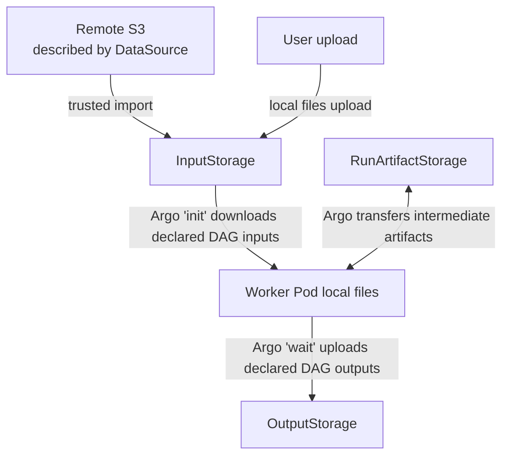
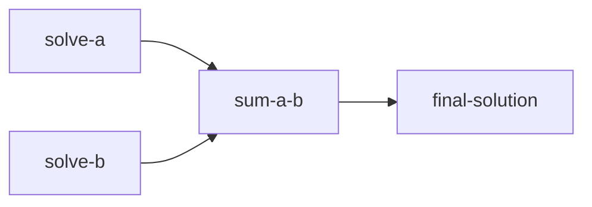
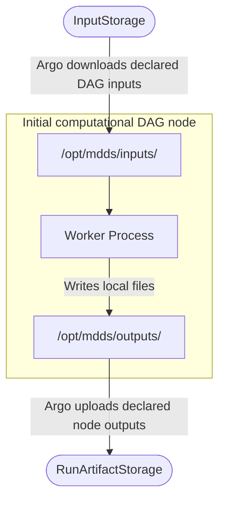
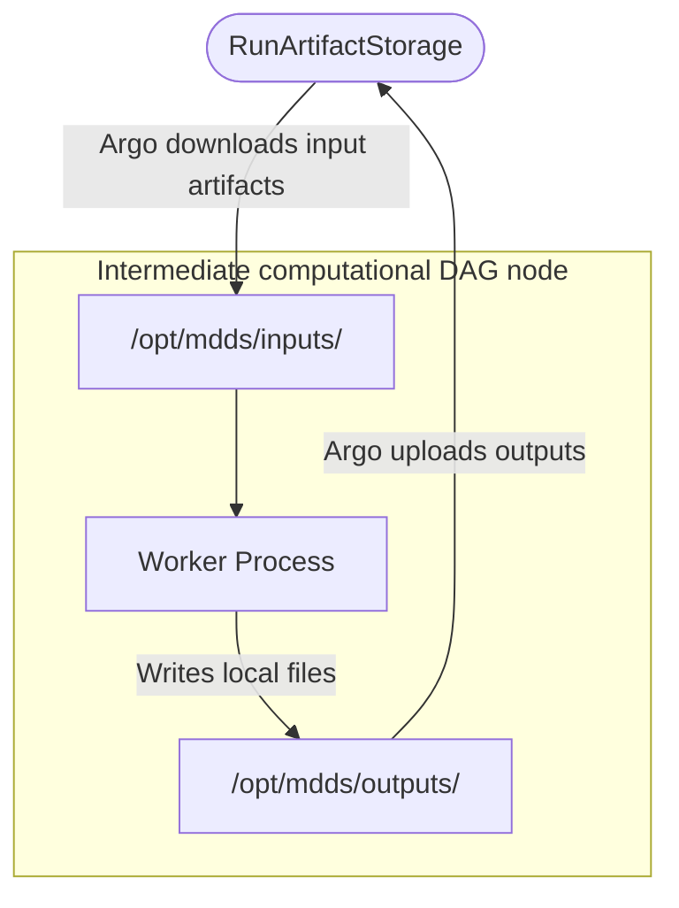
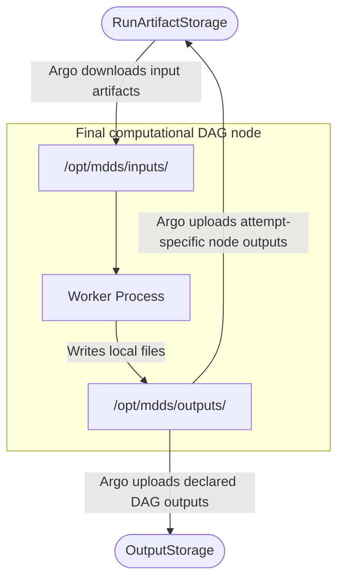
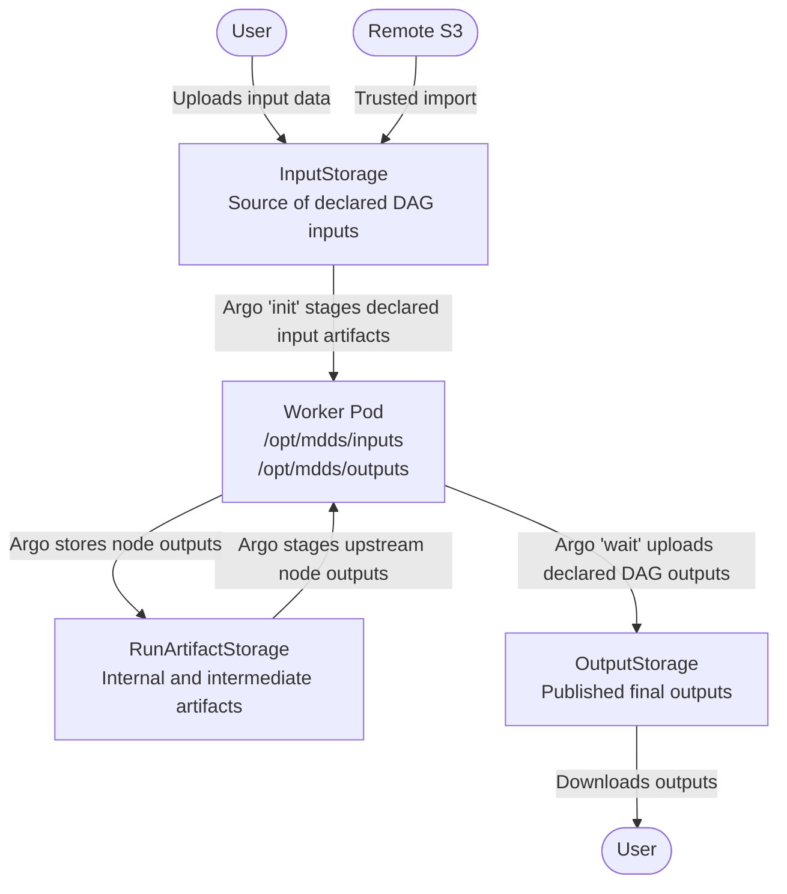
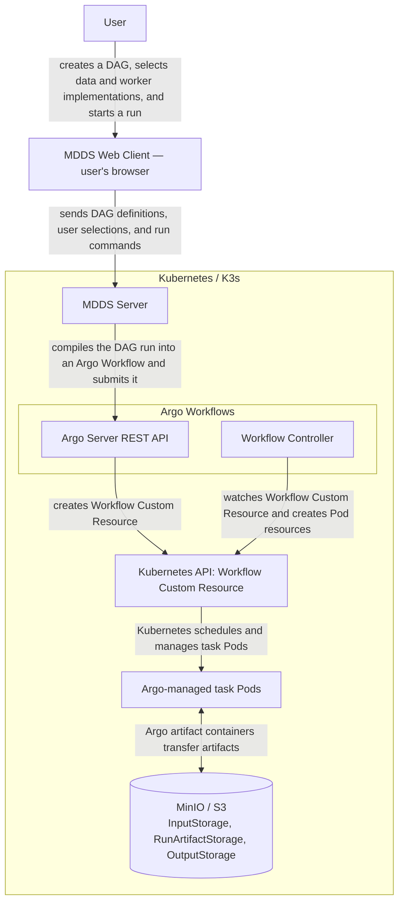

<!-- 
Copyright (c) 2025 Oleksiy Oleksandrovych Sayankin. All Rights Reserved.
Refer to the LICENSE file in the root directory for full license details.
-->


This document is an initial high-level architecture draft. It captures the current general direction of MDDS and may be refined by subsequent architecture and implementation work.

<!-- TOC -->
  * [Purpose and Architectural Approach](#purpose-and-architectural-approach)
    * [Illustrative End-to-End DAG Configuration Example](#illustrative-end-to-end-dag-configuration-example)
      * [Data sources and storages](#data-sources-and-storages)
      * [Worker Profile](#worker-profile)
      * [Worker Implementation](#worker-implementation)
      * [DAG Node](#dag-node)
      * [DAG Definition](#dag-definition)
      * [DAG Run](#dag-run)
      * [S3 object key layout](#s3-object-key-layout)
  * [Atomic Worker Image Contract](#atomic-worker-image-contract)
    * [Execution Model](#execution-model)
    * [Entrypoint](#entrypoint)
    * [Python Worker Runtime Configuration](#python-worker-runtime-configuration)
    * [Manifest](#manifest)
    * [Filesystem Layout](#filesystem-layout)
    * [Input Artifacts](#input-artifacts)
    * [Worker Manifest materialization](#worker-manifest-materialization)
    * [Output Artifacts](#output-artifacts)
    * [Exit Status](#exit-status)
    * [Diagnostics](#diagnostics)
    * [Termination](#termination)
    * [Language-Specific Runtime APIs](#language-specific-runtime-apis)
    * [Worker handler data access pattern](#worker-handler-data-access-pattern)
    * [Data flow](#data-flow)
      * [Initial DAG node data flow](#initial-dag-node-data-flow)
      * [Intermediate DAG node data flow](#intermediate-dag-node-data-flow)
      * [Final DAG node and output publication data flow](#final-dag-node-and-output-publication-data-flow)
  * [Argo Workflow Observer](#argo-workflow-observer)
  * [End-to-End Artifact Flow](#end-to-end-artifact-flow)
  * [Resource Limits and Timeouts](#resource-limits-and-timeouts)
  * [Component Responsibilities](#component-responsibilities)
  * [Architecture Decision Records](#architecture-decision-records)
<!-- TOC -->


## Purpose and Architectural Approach

MDDS is designed to simplify the creation and execution of distributed computational workflows whose operations exchange data through explicitly defined inputs and outputs.

A user defines reusable atomic computational operations, describes their input slots, parameters, and output slots, and connects those operations into a directed acyclic graph. An input of a graph node may reference either a declared DAG input stored in InputStorage or an output produced by another node in the same graph.

MDDS acts as a higher-level control and modeling layer above Argo Workflows. It allows users to define data-dependent computational graphs without working directly with Argo Workflow specifications or Kubernetes resources.

Before execution, MDDS validates the graph, checks its data-flow connections, freezes the configuration of the particular DAG Run, and compiles it into an Argo Workflow specification. The resulting workflow is submitted to Argo Server through its REST API.

Argo Workflows and Kubernetes provide the underlying execution infrastructure. They schedule graph nodes, run OCI container images, execute independent nodes in parallel, enforce dependencies, retry failed attempts, track execution state, and stop running workloads when requested.

This separation of responsibilities allows MDDS to focus on the structure and semantics of distributed computations, while Argo Workflows and Kubernetes handle their reliable container-based execution.

### Illustrative End-to-End DAG Configuration Example

This example defines a DAG that solves two systems of linear algebraic equations independently and then calculates the element-wise sum of the resulting solution vectors.

The user creates:

* Worker Profiles;
* Worker Implementations;
* a DAG Definition.

MDDS creates the DAG Run when the user starts the DAG. The DAG Run is an immutable snapshot of the concrete execution configuration.

#### Data sources and storages

* DataSource — a reusable description of a remote S3 data repository. It contains connection metadata and a credential reference used only by trusted input-import components.
* InputStorage — MDDS-managed object storage containing input artifacts uploaded by users or imported from DataSources. DAG Runs reference input artifacts only through InputStorage.
* RunArtifactStorage — trusted platform read/write storage for computational node outputs.
* OutputStorage — trusted platform write and user read storage for published DAG outputs.

Remote artifacts are imported from a configured DataSource into InputStorage before a DAG Run is created. A DAG Run references only artifacts already stored in InputStorage.




The following YAML fragments illustrate the logical MDDS model.

Example of `input-storages.yaml`

```yaml
apiVersion: mdds/v1
kind: InputStorages
inputStorages:
  - id: default-inputs
    type: s3
    bucket: mdds-inputs
    accessMode: read-only-for-execution
    credentialSecretRef: ...
```

Example of `run-artifact-storages.yaml`

```yaml
apiVersion: mdds/v1
kind: RunArtifactStorages
runArtifactStorages:
  - id: internal-runs
    type: s3
    bucket: mdds-runs
    accessMode: platform-read-write
    credentialSecretRef: ...
```

Example of `output-storages.yaml`
```yaml
apiVersion: mdds/v1
kind: OutputStorages
outputStorages:
  - id: default-outputs
    type: s3
    bucket: mdds-outputs
    accessMode: platform-write-user-read
    credentialSecretRef: ...
```

#### Worker Profile

A Worker Profile is a language-independent contract for an atomic computational operation. It defines the input slots, output slots, and parameters that compatible Worker Implementations must support. It does not represent a running Worker Process.

Example of `worker-profiles.yaml`:

```yaml
apiVersion: mdds/v1
kind: WorkerProfiles
worker-profiles:
  # Solves a system of linear algebraic equations.
  - id: solving-slae
    inputs:
      - name: matrix
        artifactType: numeric-matrix
        format: csv
      - name: rhs
        artifactType: numeric-vector
        format: csv
    params:
      - name: tolerance
        type: number
        required: false
    outputs:
      - name: solution
        artifactType: numeric-vector
        format: csv

  # Calculates the element-wise sum of two vectors.
  - id: vector-sum
    inputs:
      - name: vector-a
        artifactType: numeric-vector
        format: csv
      - name: vector-b
        artifactType: numeric-vector
        format: csv
    outputs:
      - name: solution
        artifactType: numeric-vector
        format: csv
```

#### Worker Implementation

A Worker Implementation connects a Worker Profile to a concrete OCI image. The image must implement the operation described by the Worker Profile and satisfy the Atomic Worker Image Contract.

Example of `worker-implementations.yaml`:

```yaml
apiVersion: mdds/v1
kind: WorkerImplementations
worker-implementations:
  - id: solving-slae-python
    workerProfileId: solving-slae
    ociImageReference: mddsproject/python-worker-solving-slae-numpy@sha256:<sha256-digest>

  - id: vector-sum-python
    workerProfileId: vector-sum
    ociImageReference: mddsproject/python-worker-vector-sum@sha256:<sha256-digest>
```

#### DAG Node

A DAG Node is a configured use of a Worker Profile and a Worker Implementation within a DAG Definition.

A DAG Node is a logical entity. It is not bound to a particular Kubernetes Pod. During execution, a DAG Node is compiled into an Argo DAG task, and one or more Worker Pods may execute its attempts.

#### DAG Definition

A DAG Definition is an editable logical description of a computational graph. It declares DAG inputs, DAG nodes, data-flow bindings between nodes, node parameters, and DAG outputs.

Example of `dags.yaml`:

```yaml
apiVersion: mdds/v1
kind: Dags
dags:
  - dagId: example-dag

    #
    # DAG inputs
    #
    inputs:
      matrix-a:
        artifactType: numeric-matrix
        format: csv
      rhs-a:
        artifactType: numeric-vector
        format: csv
      matrix-b:
        artifactType: numeric-matrix
        format: csv
      rhs-b:
        artifactType: numeric-vector
        format: csv

    #
    # DAG nodes
    #
    nodes:
      - nodeId: solve-a
        workerProfileId: solving-slae
        workerImplementationId: solving-slae-python

        inputBindings:
          matrix:
            from:
              dagInput: matrix-a
          rhs:
            from:
              dagInput: rhs-a

        params: {}

      - nodeId: solve-b
        workerProfileId: solving-slae
        workerImplementationId: solving-slae-python

        inputBindings:
          matrix:
            from:
              dagInput: matrix-b
          rhs:
            from:
              dagInput: rhs-b

        params: {}

      - nodeId: sum-a-b
        workerProfileId: vector-sum
        workerImplementationId: vector-sum-python

        inputBindings:
          vector-a:
            from:
              nodeOutput:
                nodeId: solve-a
                outputSlot: solution

          vector-b:
            from:
              nodeOutput:
                nodeId: solve-b
                outputSlot: solution

    #
    # DAG outputs
    #
    outputs:
      final-solution:
        from:
          nodeOutput:
            nodeId: sum-a-b
            outputSlot: solution
```

The data-flow bindings imply the following execution dependencies:




The `solve-a` and `solve-b` nodes do not depend on each other and may therefore execute in parallel. The `sum-a-b` node may start only after both solution vectors have been produced successfully.

#### DAG Run

A DAG Run represents one concrete execution of a DAG Definition.

The DAG Run is created by MDDS when the user starts the DAG. It freezes:

* the DAG structure;
* concrete input artifacts;
* Worker Profile definitions;
* Worker Implementation definitions;
* OCI image digests;
* node parameters;
* internal run artifact storage;
* final output destinations.

Subsequent modifications to the original Worker Profiles, Worker Implementations, or DAG Definition do not affect an existing DAG Run.

Example of `dag-runs.yaml`:

```yaml
apiVersion: mdds/v1
kind: DagRuns
dag-runs:
  - dagRunId: run-123
    userId: 12345
    dagId: example-dag

    #
    # Internal storage for attempt-specific node outputs
    #
    runArtifactStorage:
      id: internal-runs
      objectKeyPrefix: users/12345/dag-runs/run-123

    #
    # Concrete DAG input artifacts
    #
    inputs:
      matrix-a:
        inputStorageId: default-inputs
        objectKey: my-data/matrix-a.csv
        artifactType: numeric-matrix
        format: csv

      rhs-a:
        inputStorageId: default-inputs
        objectKey: my-data/rhs-a.csv
        artifactType: numeric-vector
        format: csv

      matrix-b:
        inputStorageId: default-inputs
        objectKey: my-data/matrix-b.csv
        artifactType: numeric-matrix
        format: csv

      rhs-b:
        inputStorageId: default-inputs
        objectKey: my-data/rhs-b.csv
        artifactType: numeric-vector
        format: csv

    #
    # Frozen node configurations
    #
    nodes:
      #
      # Solves the first system.
      #
      - nodeId: solve-a

        workerProfile:
          id: solving-slae
          inputs:
            - name: matrix
              artifactType: numeric-matrix
              format: csv
            - name: rhs
              artifactType: numeric-vector
              format: csv
          params:
            - name: tolerance
              type: number
              required: false
          outputs:
            - name: solution
              artifactType: numeric-vector
              format: csv

        workerImplementation:
          id: solving-slae-python
          workerProfileId: solving-slae
          ociImageReference: mddsproject/python-worker-solving-slae-numpy@sha256:<sha256-digest>

        inputBindings:
          matrix:
            from:
              dagInput: matrix-a
          rhs:
            from:
              dagInput: rhs-a

        params: {}

      #
      # Solves the second system.
      #
      - nodeId: solve-b

        workerProfile:
          id: solving-slae
          inputs:
            - name: matrix
              artifactType: numeric-matrix
              format: csv
            - name: rhs
              artifactType: numeric-vector
              format: csv
          params:
            - name: tolerance
              type: number
              required: false
          outputs:
            - name: solution
              artifactType: numeric-vector
              format: csv

        workerImplementation:
          id: solving-slae-python
          workerProfileId: solving-slae
          ociImageReference: mddsproject/python-worker-solving-slae-numpy@sha256:<sha256-digest>

        inputBindings:
          matrix:
            from:
              dagInput: matrix-b
          rhs:
            from:
              dagInput: rhs-b

        params: {}

      #
      # Calculates the element-wise sum of the two solution vectors.
      #
      - nodeId: sum-a-b

        workerProfile:
          id: vector-sum
          inputs:
            - name: vector-a
              artifactType: numeric-vector
              format: csv
            - name: vector-b
              artifactType: numeric-vector
              format: csv
          outputs:
            - name: solution
              artifactType: numeric-vector
              format: csv

        workerImplementation:
          id: vector-sum-python
          workerProfileId: vector-sum
          ociImageReference: mddsproject/python-worker-vector-sum@sha256:<sha256-digest>

        inputBindings:
          vector-a:
            from:
              nodeOutput:
                nodeId: solve-a
                outputSlot: solution

          vector-b:
            from:
              nodeOutput:
                nodeId: solve-b
                outputSlot: solution

    #
    # Concrete DAG output destinations
    #
    outputs:
      final-solution:
        from:
          nodeOutput:
            nodeId: sum-a-b
            outputSlot: solution
            format: csv

        destination:
          outputStorageId: default-outputs
          objectKey: my-outputs/sum-a-b.csv
```

MDDS generates attempt-specific intermediate output locations under the configured run artifact prefix. For example:

```text
s3://mdds-runs/users/12345/dag-runs/run-123/nodes/solve-a/attempts/attempt-0/outputs/solution
s3://mdds-runs/users/12345/dag-runs/run-123/nodes/solve-b/attempts/attempt-0/outputs/solution
s3://mdds-runs/users/12345/dag-runs/run-123/nodes/sum-a-b/attempts/attempt-0/outputs/solution
```

These internal locations are not selected by the user.

#### S3 object key layout

The following bucket names and object key layout apply to the default MDDS-managed S3 storages:

* mdds-inputs
* mdds-runs
* mdds-outputs

Input and output artifacts use the following user-specific key layout:

```text
users/{userId}/data/{relativeObjectPath}
```

Common input data storage folder structure:

```text
s3://mdds-inputs/users/{userId}/data/{customUserFolder}/{userFile}
```

Attempt specific layout:

```text
s3://mdds-runs/users/{userId}/dag-runs/{dagRunId}/nodes/{nodeId}/attempts/{attemptId}/outputs/{outputSlot}
```

Common output artifact storage folder structure:

```text
s3://mdds-outputs/users/{userId}/data/{customUserFolder}/{userFile}
```

For `userId` equals to `12345` and `dagRunId` equals to `run-123`, the InputStorage objects are:

```text
s3://mdds-inputs/users/12345/data/my-data/matrix-a.csv
s3://mdds-inputs/users/12345/data/my-data/rhs-a.csv
s3://mdds-inputs/users/12345/data/my-data/matrix-b.csv
s3://mdds-inputs/users/12345/data/my-data/rhs-b.csv
```

Attempt specific layout:

```text

s3://mdds-runs/users/12345/dag-runs/run-123/nodes/solve-a/attempts/attempt-0/outputs/solution
s3://mdds-runs/users/12345/dag-runs/run-123/nodes/solve-b/attempts/attempt-0/outputs/solution
s3://mdds-runs/users/12345/dag-runs/run-123/nodes/sum-a-b/attempts/attempt-0/outputs/solution
```

Outputs of DAG run

```text
s3://mdds-outputs/users/12345/data/my-outputs/sum-a-b.csv
```


## Atomic Worker Image Contract

An OCI image is considered compatible with MDDS when it satisfies the requirements defined by the Atomic Worker Image Contract.

### Execution Model

Each Worker Pod executes exactly one atomic DAG node attempt.

The worker must run as a finite process. It must perform the assigned operation and terminate. A compatible worker must not behave as a persistent service, message consumer, or background daemon.

### Entrypoint

The generated Argo Workflow starts the Worker Process using:

```text
/opt/mdds/bin/mdds-worker
```

The Worker Runtime reads the Worker Manifest from the canonical path:

```text
/opt/mdds/config/worker-manifest.json
```

The executable may be implemented in any programming language. It may be a native binary, an interpreter launcher, or a wrapper around a language-specific runtime.

The Argo Workflow specification explicitly defines this command and does not depend on an image-specific entrypoint.

### Python Worker Runtime Configuration

The Worker Image defines `MDDS_WORKER_NAME`, `MDDS_WORKER_VERSION`, and `MDDS_WORKER_HANDLER`. The generated Argo Workflow supplies `MDDS_ARGO_RETRY_INDEX` for each concrete attempt.

| Variable Name           | Required | Default Value | Meaning                                                                                                                | Example                                                           |
|-------------------------|---------:|--------------:|------------------------------------------------------------------------------------------------------------------------|-------------------------------------------------------------------|
| `MDDS_WORKER_NAME`      |      Yes |             — | Stable name of the concrete Worker packaged in the OCI image. Used in logs and execution diagnostics.                  | `solving-slae-python`                                             |
| `MDDS_WORKER_VERSION`   |      Yes |             — | Version of the concrete Worker packaged in the OCI image. Used in logs and execution diagnostics.                      | `0.1.0`                                                           |
| `MDDS_WORKER_HANDLER`   |      Yes |             — | Python import path of the concrete worker handler.                                                                     | `mdds_python_worker_solving_slae_numpy.handler:SlaeWorkerHandler` |
| `MDDS_ARGO_RETRY_INDEX` |      Yes |             — | Zero-based index of the current Argo-managed attempt: `0` for the initial attempt, `1` for the first retry, and so on. | `0`                                                               |


### Manifest

A Node Run is the execution of one DAG Node within one DAG Run and is identified by `dagRunId` and `nodeId`. Argo may create one or more Node Attempts for a Node Run. A Node Attempt is identified by `dagRunId`, `nodeId`, and the Argo retry index.
The Worker Manifest describes one Node Run. It remains unchanged between attempts. The Worker Runtime derives the current Node Attempt identifier from `MDDS_ARGO_RETRY_INDEX`, for example `attempt-0`, `attempt-1`, and so on.
This is `worker-manifest.json` example for worker profile with `id` = `solving-slae` for `nodeId` = `solve-a`:

```json
{
  "apiVersion": "mdds/v1",
  "kind": "WorkerManifest",
  "execution": {
    "userId": 12345,
    "dagRunId": "<dag-run-id>",
    "nodeId": "solve-a"
  },
  "inputs": {
    "matrix": {
      "path": "/opt/mdds/inputs/matrix",
      "format": "csv"
    },
    "rhs": {
      "path": "/opt/mdds/inputs/rhs",
      "format": "csv"
    }
  },
  "params": {},
  "outputs": {
    "solution": {
      "path": "/opt/mdds/outputs/solution",
      "format": "csv"
    }
  }
}
```

This is `worker-manifest.json` example for worker profile with `id` = `vector-sum` for `nodeId` = `sum-a-b`:

```json
{
  "apiVersion": "mdds/v1",
  "kind": "WorkerManifest",
  "execution": {
    "userId": 12345,
    "dagRunId": "<dag-run-id>",
    "nodeId": "sum-a-b"
  },
  "inputs": {
    "vector-a": {
      "path": "/opt/mdds/inputs/vector-a",
      "format": "csv"
    },
    "vector-b": {
      "path": "/opt/mdds/inputs/vector-b",
      "format": "csv"
    }
  },
  "params": {},
  "outputs": {
    "solution": {
      "path": "/opt/mdds/outputs/solution",
      "format": "csv"
    }
  }
}
```

### Filesystem Layout

The worker must use the following filesystem layout:

```text
/opt/mdds/config/   Worker configuration and worker manifest
/opt/mdds/inputs/   Input artifacts prepared by Argo
/opt/mdds/outputs/  Output artifacts produced by the worker
/opt/mdds/result/   Structured execution result
/opt/mdds/tmp/      Temporary working data
```

Input and output slots are mapped to filesystem paths by slot name:

```text
/opt/mdds/inputs/{inputSlot}
/opt/mdds/outputs/{outputSlot}
```

The exact paths and artifact metadata are also provided in the Worker Manifest.

### Input Artifacts

Argo Workflows retrieves computational input artifacts from the configured artifact repository and places them at the paths declared in the generated Workflow specification.

The worker must read input data only from the paths defined in the Worker Manifest. The worker must not interact directly with S3 or any other object storage. Argo artifact containers and trusted MDDS platform components perform all object-storage transfers.

### Worker Manifest materialization

Worker parameters and artifact bindings are serialized in the language-independent Worker Manifest. Individual operation parameters are not exposed through language-specific serialization or separate environment variables.
For each Node Run, MDDS serializes the frozen Worker Manifest and embeds it in the generated Argo DAG task as a raw input artifact.
Before each Node Attempt starts, the Argo executor materializes the Worker Manifest at the canonical path:

```text
/opt/mdds/config/worker-manifest.json
```

The generated Argo Workflow then starts the Worker Process using:

```text
/opt/mdds/bin/mdds-worker
```

The Worker Manifest is control-plane metadata embedded in the generated Workflow. It is not sourced from InputStorage and is not stored as user data in RunArtifactStorage.

The following abbreviated Workflow excerpt illustrates only how the Worker Manifest for `nodeId` `sum-a-b` is embedded and materialized. Computational input and output artifacts, retry configuration, and other generated tasks and templates are omitted. 

```yaml
apiVersion: argoproj.io/v1alpha1
kind: Workflow
metadata:
  generateName: mdds-run-
spec:
  entrypoint: mdds-dag

  templates:
    - name: mdds-dag
      dag:
        tasks:
          - name: sum-a-b
            template: vector-sum-worker
            arguments:
              artifacts:
                - name: worker-manifest
                  raw:
                    data: |
                      {
                        "apiVersion": "mdds/v1",
                        "kind": "WorkerManifest",
                        "execution": {
                          "userId": 12345,
                          "dagRunId": "<dag-run-id>",
                          "nodeId": "sum-a-b"
                        },
                        "inputs": {
                          "vector-a": {
                            "path": "/opt/mdds/inputs/vector-a",
                            "format": "csv"
                          },
                          "vector-b": {
                            "path": "/opt/mdds/inputs/vector-b",
                            "format": "csv"
                          }
                        },
                        "params": {},
                        "outputs": {
                          "solution": {
                            "path": "/opt/mdds/outputs/solution",
                            "format": "csv"
                          }
                        }
                      }

    - name: vector-sum-worker
      inputs:
        artifacts:
          - name: worker-manifest
            path: /opt/mdds/config/worker-manifest.json
            mode: 0444

      container:
        image: >-
          mddsproject/python-worker-vector-sum@sha256:<image-digest>
        command:
          - /opt/mdds/bin/mdds-worker
```

### Output Artifacts

The worker must write each declared output artifact to its corresponding path under:

```text
/opt/mdds/outputs/
```

Before reporting successful execution, the worker must:

1. finish all output writes;
2. close and flush all output files;
3. verify that all required output slots exist;
4. ensure that no required output contains an incomplete temporary result.

Temporary output files should be written under `/opt/mdds/tmp/` or with a temporary name and atomically moved to the declared output path after successful completion.

Argo Workflows collects the declared output artifacts after the worker process terminates.

### Exit Status

The worker communicates its primary execution result through the exit status of the main container process.

```text
exit 0 — success
exit 1 — execution failure; no retry by default
exit 2 — contract violation; never retry
exit 143 — the Worker Runtime completed the runtime-managed SIGTERM termination path during supervised worker execution.
Argo Error / transient infrastructure failure — retry according to platform policy
```

MDDS v1 assigns the following conventional meanings:

```text
0  SUCCESS
1  EXECUTION_FAILED
2  WORKER_CONTRACT_VIOLATION
143  SIGTERM_TERMINATED
```

Any other non-zero exit code is also treated as failed execution.

Exit code `0` is valid only when all required outputs have been created successfully.

The final authoritative node state is the state reported by Argo Workflows. A worker exit code of `0` does not make the node successful when Argo cannot collect or publish its required output artifacts.

### Diagnostics

The worker must write normal operational logs to standard output and standard error.

When possible, the worker should write a short final diagnostic message to:

```text
/dev/termination-log
```

The worker should also create:

```text
/opt/mdds/result/result.json
```

with structured success or error details.

The result file is diagnostic metadata and is not the authoritative execution state. It may be absent when the container cannot start or is terminated by the infrastructure.

### Termination

In this version of the Atomic Worker Image Contract, runtime-managed `SIGTERM` handling is guaranteed only while the supervised child process dedicated to executing `WorkerHandler.execute(context)` is running. Worker Runtime setup and finalization operations are expected to be short-lived and are not required to be interruptible through the managed `SIGTERM` path.
If the main Worker Runtime process receives `SIGTERM` while the supervised `WorkerHandler.execute(context)` process is running, it treats the signal as an unconditional request to abort the current Node Attempt. The Worker Runtime must:

1. immediately interrupt its wait for that supervised process and force-terminate it with `SIGKILL`;
2. not forward `SIGTERM` to the supervised process;
3. not wait for handler-defined shutdown or cleanup;
4. not validate or report outputs produced by the aborted attempt as successful;
5. atomically write a termination diagnostic result to `/opt/mdds/result/result.json` with `exitCode` set to `143`;
6. exit with code `143` (`128 + SIGTERM`) after completing the runtime-managed termination path;
7. complete the runtime-managed termination path before the configured Kubernetes termination grace period expires.

This guarantee does not apply before the supervised process starts or after it completes. This includes configuration and manifest loading, execution-context construction and persistence, output validation, result persistence, and runtime cleanup. These runtime-owned operations are assumed to be short-lived in this contract version and are not required to be interrupted through the managed `SIGTERM` path.
Consequently, when `SIGTERM` is received outside the supervised execution phase, this contract version does not guarantee that the Worker Runtime writes a termination `result.json` or exits through its runtime-managed exit-code `143` path.
A `WorkerHandler` must not rely on receiving `SIGTERM`, executing a termination callback, or performing cleanup during termination.
User-requested cancellation is determined by Argo Workflow state and is not represented by a special worker exit code.

### Language-Specific Runtime APIs

The Atomic Worker Image Contract is language-independent and mandatory.

Language-specific runtime APIs are optional convenience layers built on top of this contract. For example, the Python Worker Runtime may preserve the following interface:

```python
class WorkerHandler:
    def execute(self, context: WorkerExecutionContext) -> None:
        ...
```

The runtime is responsible for reading the Worker Manifest, preparing `WorkerExecutionContext`, invoking the handler, validating outputs, writing diagnostic information, handling termination signals, and converting the result into the appropriate process exit code.

A user may implement the Atomic Worker Image Contract directly without using a language-specific MDDS runtime.

### Worker handler data access pattern

A concrete `WorkerHandler` must access worker inputs, parameters, and outputs only through `WorkerExecutionContext`.

The handler must use logical input slots declared in `manifest.inputs` to read input artifacts:

```python
input_bytes = context.inputs.read("inputSlot")
```

For large input artifacts, or when a library expects a file path, the handler should use the local input path instead of loading the full artifact into memory:

```python
input_path = context.inputs.path("inputSlot")
```

If artifact metadata is required, the handler may access it through:

```python
input_artifact = context.inputs.get("inputSlot")
input_format = input_artifact.format
```

Execution parameters must be read through `context.params`:

```python
required_value = context.params.required("requiredParameter")
optional_value = context.params.get("optionalParameter", default_value)
```

Output artifacts must be written through logical output slots declared in `manifest.outputs`:

```python
context.outputs.write("outputSlot", output_bytes)
```

If a library needs to write directly to a file path, the handler may resolve the runtime-managed local output path:

```python
output_path = context.outputs.path("outputSlot")
```

The Worker Runtime resolves logical input and output slots declared in the Worker Manifest to runtime-managed local filesystem paths. It reads inputs from and writes outputs to those local paths only.

After the Worker process terminates, the Argo `wait` container attempts to upload each declared node output artifact to its attempt-specific location in RunArtifactStorage. If the node output is bound to a declared DAG output, the same wait container also uploads the same local file directly to the configured OutputStorage destination.

Only artifacts produced by a Node Attempt whose authoritative Argo state is `Succeeded` may be consumed by downstream tasks. The existence of an object in RunArtifactStorage does not by itself indicate successful node execution.

In Argo Workflows 4.0.8, the `wait` container performs output collection after the `main` container terminates, including when `main` exits with code 1, 2, or 143. Therefore, if a declared local output file exists, a partial or otherwise invalid file may be uploaded to RunArtifactStorage and, for a declared DAG output, to OutputStorage. These uploads are independent and non-transactional. The presence of an object in either storage does not indicate a successful Node Attempt; the authoritative state is reported by Argo Workflows.

Conceptually, a worker handler follows this structure:

```python
class ExampleWorkerHandler:
    def execute(self, context: WorkerExecutionContext) -> None:
        input_a = context.inputs.read("inputSlotA")
        input_b_path = context.inputs.path("inputSlotB")
        required_parameter = context.params.required("requiredParameter")

        # Execute worker-specific business logic.
        output_bytes = run_worker_specific_logic(
            input_a,
            input_b_path,
            required_parameter,
        )

        context.outputs.write("outputSlot", output_bytes)
```

### Data flow

In the standard Argo Workflows 4.0 container-template execution model used by MDDS, each computational DAG task runs in a Pod containing three containers:

* the `init` container downloads the input artifacts to their configured local paths;
* the `main` container runs the user-provided Worker Image;
* the `wait` container uploads the declared output artifacts after the main container completes.


| DAG task or stage                                                         | Artifact source                                                                        | Artifact destination                                                | Responsible component            |
|---------------------------------------------------------------------------|----------------------------------------------------------------------------------------|---------------------------------------------------------------------|----------------------------------|
| Input artifact materialization for each computational DAG task            | `InputStorage` for declared DAG inputs; `RunArtifactStorage` for upstream node outputs | `/opt/mdds/inputs/{inputSlot}`                                      | Argo Executor (`init` container) |
| Computational DAG task                                                    | `/opt/mdds/inputs/{inputSlot}`                                                         | `/opt/mdds/outputs/{outputSlot}`                                    | Worker (`main` container)        |
| Output artifact collection after the Worker (`main` container) terminates | `/opt/mdds/outputs/{outputSlot}`                                                       | `RunArtifactStorage` and, for declared DAG outputs, `OutputStorage` | Argo Executor (`wait` container) |

**RunArtifactStorage** is an S3 artifact repository used by Argo to store computational node outputs. Each DAG Run uses an isolated key namespace within the selected repository.

#### Initial DAG node data flow



#### Intermediate DAG node data flow



#### Final DAG node and output publication data flow


The diagram shows one output-producing computational node. A DAG Run may contain multiple producers of declared DAG outputs.

## Argo Workflow Observer

The Argo Workflow Observer periodically reads the authoritative Workflow state through the Argo Server REST API and reconciles it with the MDDS DAG Run state.
The initial observer strategy includes:

* periodic REST polling;
* reconciliation on server startup;
* reconciliation after uncertain submission.

## End-to-End Artifact Flow




## Resource Limits and Timeouts

Define policy for resource limits and timeouts.

```yaml
executionPolicy:
  timeout: PT30M

  resources:
    requests:
      cpu: "500m"
      memory: "512Mi"
      ephemeralStorage: "1Gi"

    limits:
      cpu: "2"
      memory: "4Gi"
      ephemeralStorage: "10Gi"
```


## Component Responsibilities



The responsibilities are distributed as follows:

* **MDDS Web Client** — allows users to create a DAG and select data and worker implementations.
* **MDDS Server** — stores the MDDS model, creates a snapshot of a specific DAG run, compiles it into a single Argo Workflow, and submits it through the Argo Server REST API.
* **Argo Server** — accepts the Workflow and provides an API and UI.
* **Workflow Controller** — interprets the generated Argo Workflow and creates Pods for computational DAG tasks.
* **Kubernetes/K3s** — schedules and runs Argo-managed task Pods.
* **MinIO/S3** — stores input data, intermediate artifacts, and output artifacts.


## Architecture Decision Records

* **ADR-1**: MDDS uses the Argo Server REST API as its only execution-platform API. Communication uses HTTPS and JSON. gRPC is not used in MDDS v1.
* **ADR-2**: User-provided Worker Images never receive direct write access to either InputStorage or OutputStorage. Workers operate only on local input and output paths. Argo and trusted MDDS platform components transfer artifacts between local paths and object storage.
* **ADR-3**: Intermediate artifacts are written only to run-specific, attempt-specific namespaces.
* **ADR-4**: Storage credentials are mounted only into trusted artifact-transfer or publication components. They are never included in the Worker Manifest or mounted into the user-provided Worker container.
* **ADR-5**: An OCI Worker Image does not contain input data and does not receive input data during the image build process.
* **ADR-6**: Argo stages input artifacts into the running Worker Pod before the Worker Process starts.
* **ADR-7**: The Worker operates only on local filesystem paths under `/opt/mdds` and does not interact directly with object storage.
* **ADR-8**: Each generated Argo template explicitly declares all input and output artifacts together with their corresponding local filesystem paths.
* **ADR-9**: Argo Workflows is the sole owner of automatic Node Attempt retries. The generated Workflow defines retry eligibility and exposes Argo’s retry index to both artifact-location templates and the Worker Runtime. The canonical MDDS attempt identifier is derived from that index.
* **ADR-10**: Every standalone MDDS configuration and runtime document declares its contract through the top-level `apiVersion` and `kind` fields. `apiVersion` identifies the versioned schema and semantics, while `kind` identifies the document type. Embedded objects inherit the contract of the enclosing document and do not repeat these fields.
* **ADR-11**: For each Node Attempt, worker-specific computation executes in a single process and must not create child processes of its own.
